# Data Flow

Complete documentation of request/response flows, data processing pipelines, and system interactions in Echo Alexandria.

## Request/Response Flows

### Search Request Flow

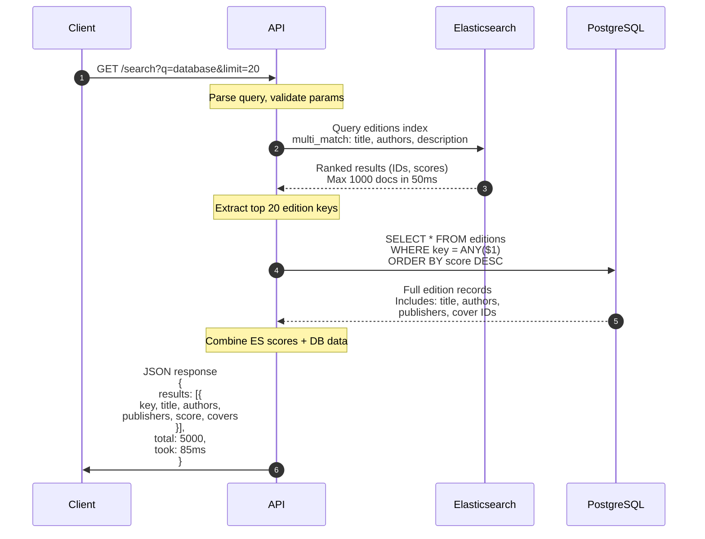

**Performance Breakdown:**
- Query parsing: 1ms
- Elasticsearch query: 50ms (99th percentile)
- PostgreSQL fetch: 20ms
- JSON serialization: 5ms
- Total: 76ms (typical)

**Key Optimizations:**
1. Elasticsearch returns only IDs (small payload)
2. Limit PostgreSQL fetch to top 20 results
3. Connection pooling prevents connection overhead
4. Response caching at CDN layer

### Catalog Request Flow (Single Edition)

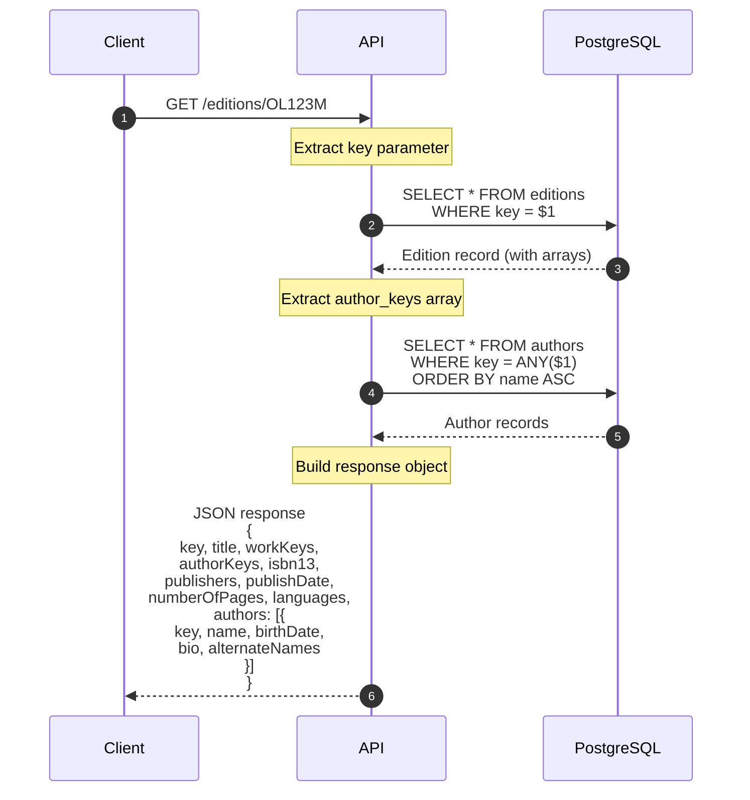

**Performance Characteristics:**
- Primary key lookup: < 1ms (B-tree index)
- Author array lookup: < 5ms (GIN index)
- Total: < 10ms (typical)

**Caching:**
- HTTP Cache-Control: max-age=3600 (1 hour)
- CDN edge caching: 24 hours
- Browser cache: User preference

### Author Discovery Flow

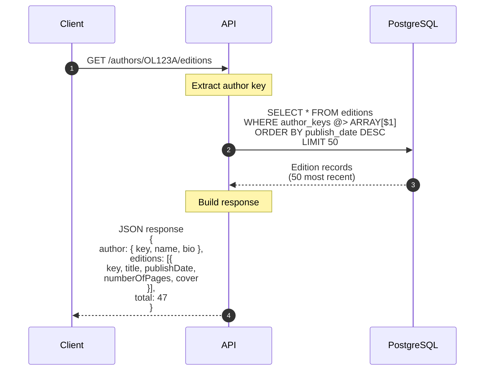

**Performance:**
- Array containment query: 10-20ms (GIN index)
- Result set size: 50 editions
- Total: 25ms (typical)

## Import Pipeline Flows

### End-to-End Import Process

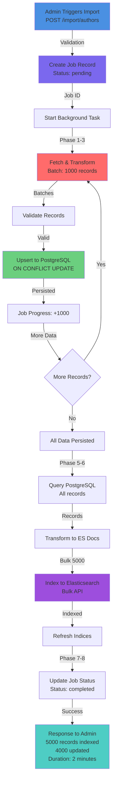

### Batch Insertion Flow (PostgreSQL)

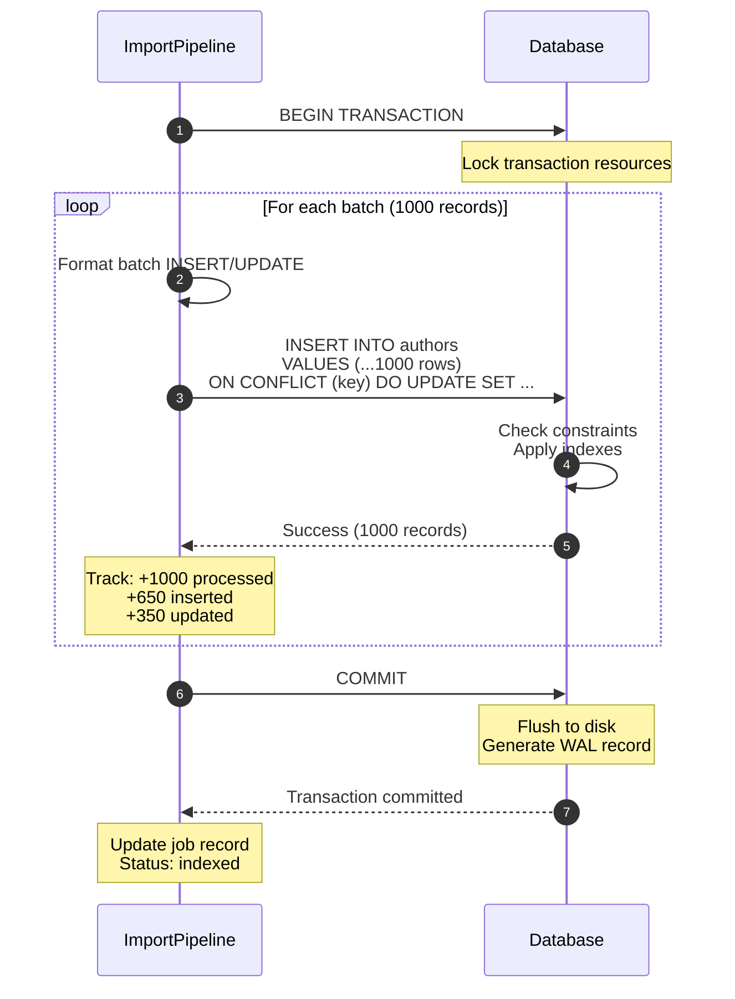

**Batch Upsert SQL:**
```sql
INSERT INTO authors (
  key, name, personal_name, bio, birth_date, death_date,
  alternate_names, photos, raw_data
) VALUES
  ($1, $2, $3, $4, $5, $6, $7, $8, $9),
  ($10, $11, $12, $13, $14, $15, $16, $17, $18),
  -- ... up to 1000 rows ...
ON CONFLICT (key) DO UPDATE SET
  name = EXCLUDED.name,
  personal_name = EXCLUDED.personal_name,
  bio = EXCLUDED.bio,
  birth_date = EXCLUDED.birth_date,
  death_date = EXCLUDED.death_date,
  alternate_names = EXCLUDED.alternate_names,
  photos = EXCLUDED.photos,
  raw_data = EXCLUDED.raw_data,
  last_imported = now();
```

**Performance:**
- Batch size: 1000 records
- Throughput: 20,000-50,000 records/second
- Network round-trips: 1 per batch
- Disk writes: Batched by PostgreSQL

### Elasticsearch Indexing Flow

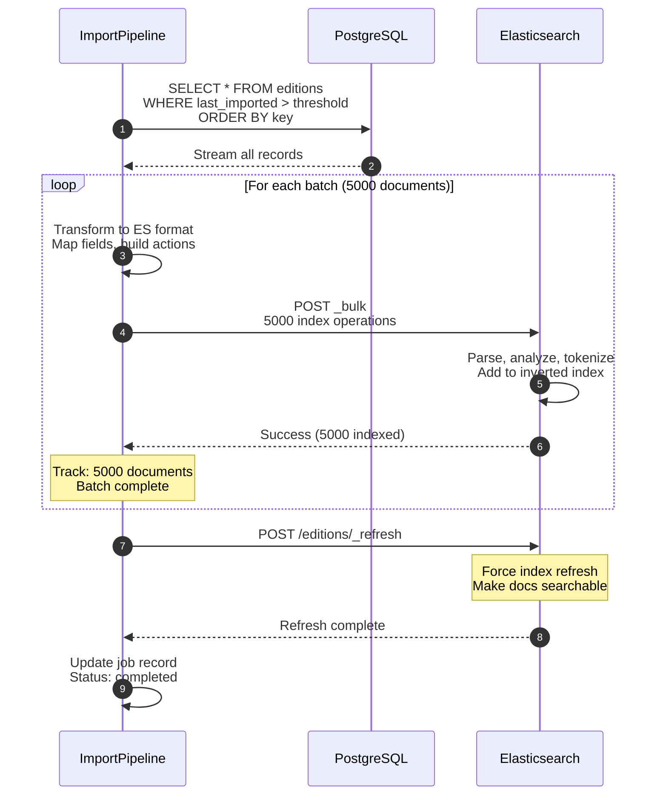

**Bulk API Format:**
```json
POST _bulk
{ "index": { "_index": "editions", "_id": "/books/OL1M" } }
{ "key": "/books/OL1M", "title": "The Stand", "authors": ["Stephen King"], "isbn13": ["978-0385333832"] }
{ "index": { "_index": "editions", "_id": "/books/OL2M" } }
{ "key": "/books/OL2M", "title": "It", "authors": ["Stephen King"], "isbn13": ["978-0451169174"] }
```

**Performance:**
- Bulk batch size: 5,000 documents
- Throughput: 50,000-100,000 docs/sec
- Latency: 100-200ms per batch
- Total indexing time: 5-10 minutes for 1M documents

## Admin Import Trigger Flow

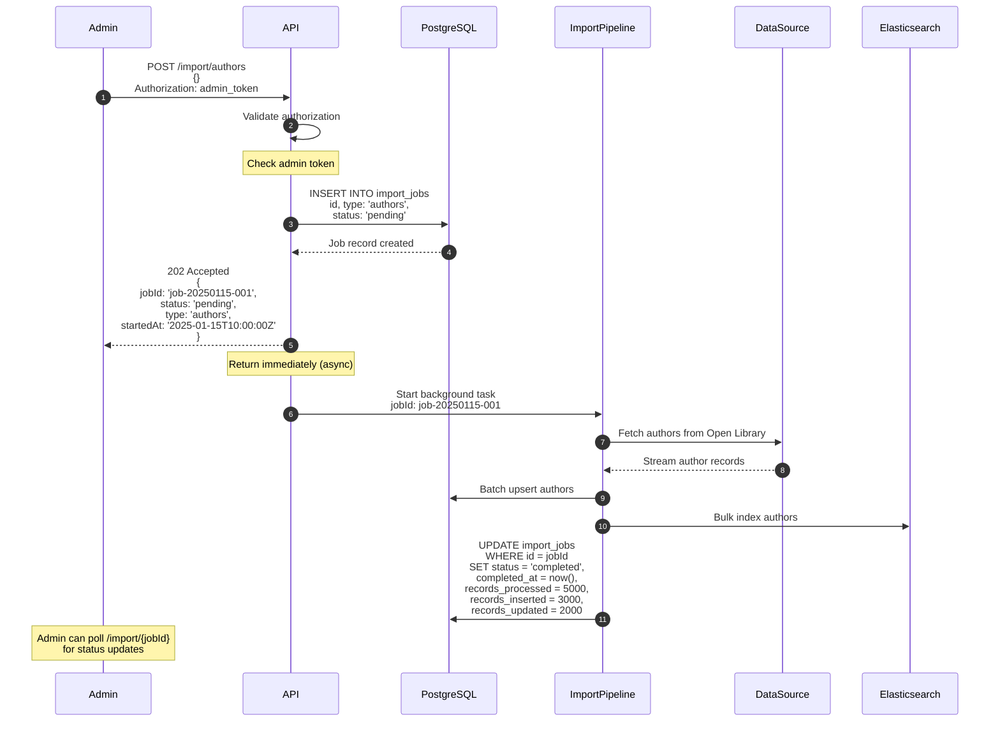

**Job Status Polling:**
```
GET /import/job-20250115-001

Response:
{
  id: "job-20250115-001",
  type: "authors",
  status: "running",
  recordsProcessed: 3500,
  recordsInserted: 2100,
  recordsUpdated: 1400,
  startedAt: "2025-01-15T10:00:00Z",
  completedAt: null,
  error: null
}
```

## Health Check Flow

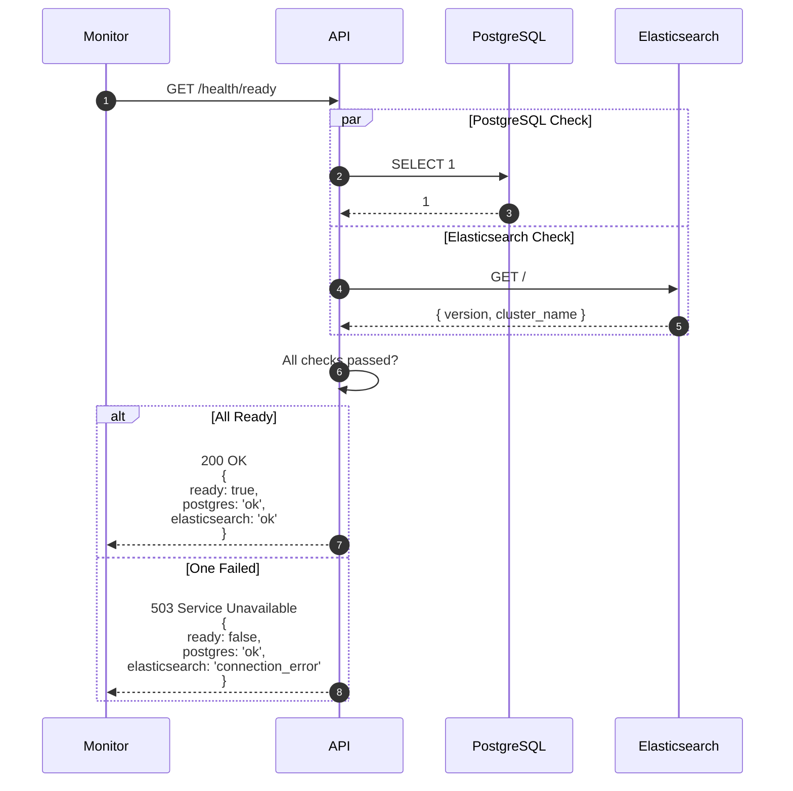

## Database Connection Lifecycle

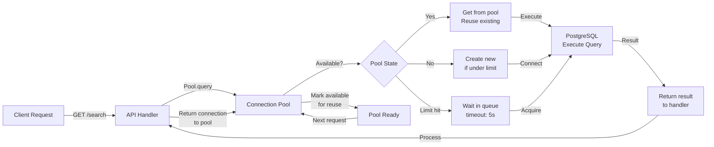

**Connection Pool Configuration:**
- Min connections: 2
- Max connections: 10
- Idle timeout: 30 seconds
- Query timeout: 30 seconds

## Elasticsearch Query Lifecycle

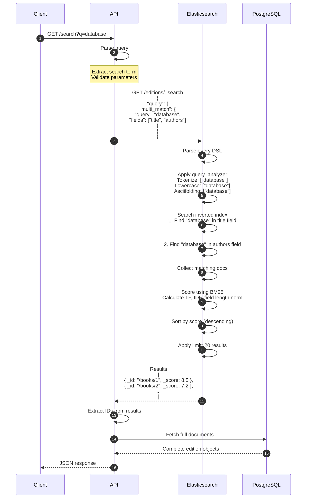

## Batch Processing Flow

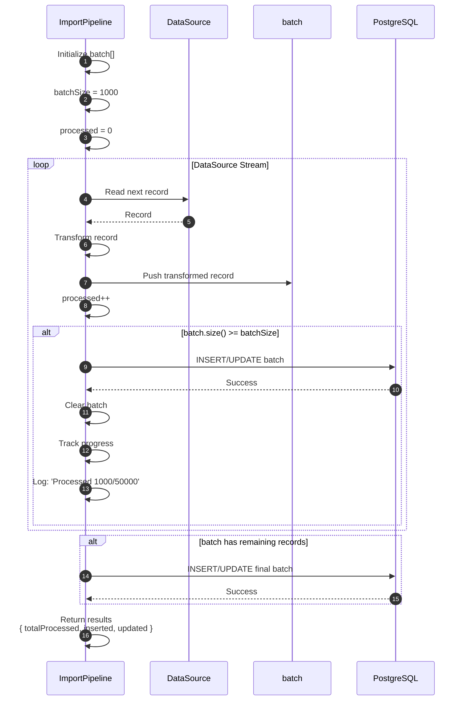

**Pseudo-code:**
```typescript
let batch = [];
let processed = 0;

for await (const record of dataSource) {
  const transformed = transformRecord(record);
  batch.push(transformed);
  processed++;

  if (batch.length >= 1000) {
    await db.upsertBatch(batch);
    batch = [];
    logProgress({ processed, total: estimate });
  }
}

// Final partial batch
if (batch.length > 0) {
  await db.upsertBatch(batch);
}

return {
  totalProcessed: processed,
  totalInserted: inserted,
  totalUpdated: updated
};
```

## Upsert Conflict Resolution Flow

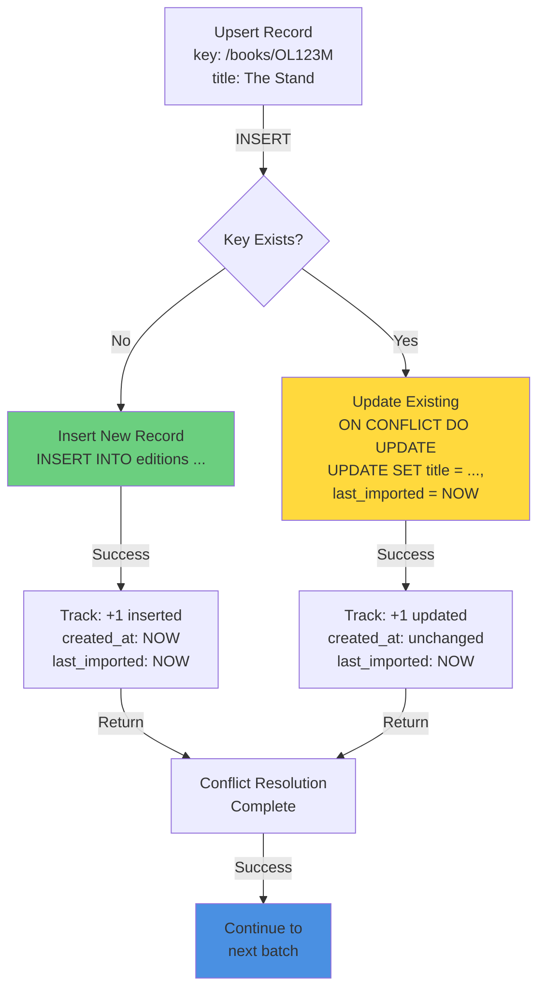

## Error Handling Flows

### Database Connection Failure

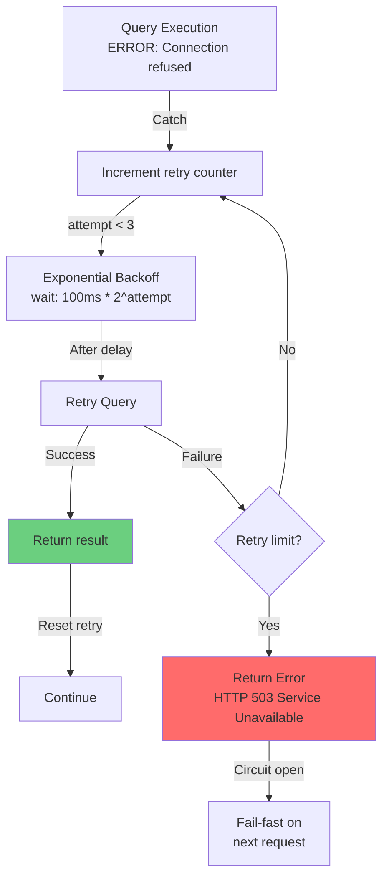

### Import Job Error Recovery

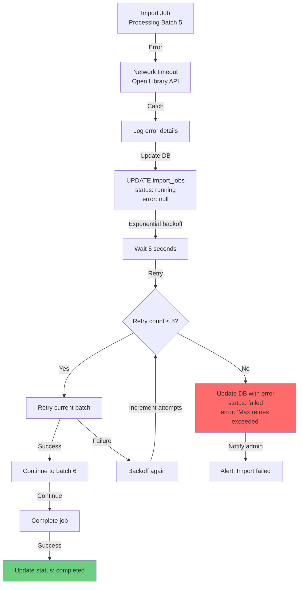

## Performance Characteristics

### Search Response Time Distribution

```
Query: /search?q=database

P50:   75ms (median)
P95:   120ms (95th percentile)
P99:   180ms (99th percentile)
P99.9: 250ms (tail)

Breakdown:
- Elasticsearch: 50ms (P99)
- PostgreSQL: 20ms (P99)
- JSON: 5ms
- Network: 5ms
```

### Import Throughput

```
Dataset: 50,000 authors

Single-threaded batch processing:
- Fetch: 5-10 seconds
- Transform: 2-5 seconds
- PostgreSQL upsert: 15-25 seconds (25 batches)
- ES index: 10-15 seconds
- Total: 40-60 seconds

Throughput: 1,000 records/second average
```

### Index Size Estimates

```
PostgreSQL:
- 1M editions: ~500MB
- 100K authors: ~50MB
- 500K works: ~200MB
- Total + indexes: ~2GB

Elasticsearch:
- 1M editions index: ~800MB
- 100K authors index: ~50MB
- Total: ~1GB
```

---

**See Also:**
- [System Design](/docs/architecture/system-design) - High-level architecture
- [Database Schema](/docs/architecture/database-schema) - PostgreSQL structure
- [Elasticsearch Indices](/docs/architecture/elasticsearch-indices) - Search configuration
- [Technology Stack](/docs/architecture/technology-stack) - Dependency details
