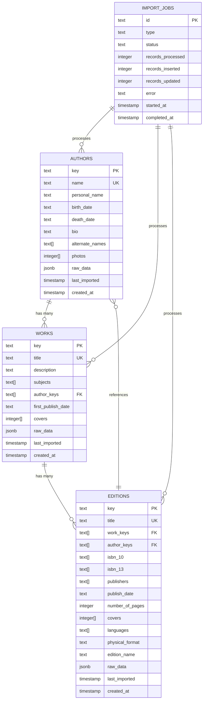

# Database Schema

Complete PostgreSQL schema documentation for Echo Alexandria, including table structures, relationships, indexes, and query patterns.

## Entity-Relationship Diagram



## Table Definitions

### Authors Table

The `authors` table stores bibliographic information about book authors.

**SQL Definition:**
```sql
CREATE TABLE "authors" (
  "key" text PRIMARY KEY NOT NULL,
  "name" text NOT NULL,
  "personal_name" text,
  "birth_date" text,
  "death_date" text,
  "bio" text,
  "alternate_names" text[],
  "photos" integer[],
  "raw_data" jsonb,
  "last_imported" timestamp DEFAULT now() NOT NULL,
  "created_at" timestamp DEFAULT now() NOT NULL
);
```

**Field Descriptions:**

| Field | Type | Nullable | Description | Example |
|-------|------|----------|-------------|---------|
| key | text | NO | Unique identifier from source system | `/authors/OL123A` |
| name | text | NO | Primary display name | "Stephen King" |
| personal_name | text | YES | Alternative name format | "King, Stephen" |
| birth_date | text | YES | Birth date (flexible format) | "1947-09-21" |
| death_date | text | YES | Death date (flexible format) | null |
| bio | text | YES | Biographical information | "American author of horror fiction..." |
| alternate_names | text[] | YES | Alternative names/pseudonyms | `{"Stephen Edwin King", "Richard Bachman"}` |
| photos | integer[] | YES | References to photo identifiers | `{1234, 5678}` |
| raw_data | jsonb | YES | Original data from source | `{"viaf": "...", "olid": "..."}` |
| last_imported | timestamp | NO | Last sync timestamp | `2025-01-15 10:30:00` |
| created_at | timestamp | NO | Record creation time | `2025-01-01 00:00:00` |

**Indexes:**
```sql
-- B-tree index for exact name lookups
CREATE INDEX "authors_name_idx" ON "authors" USING btree ("name");

-- GIN tsvector index for full-text search
CREATE INDEX "authors_name_gin_idx" ON "authors"
  USING gin (to_tsvector('english', "name"));
```

**Index Purpose:**
- `authors_name_idx`: O(log n) lookup for equality queries
- `authors_name_gin_idx`: Full-text search with linguistic analysis

### Works Table

The `works` table represents unique literary works (abstract concept of a book).

**SQL Definition:**
```sql
CREATE TABLE "works" (
  "key" text PRIMARY KEY NOT NULL,
  "title" text NOT NULL,
  "description" text,
  "subjects" text[],
  "author_keys" text[],
  "first_publish_date" text,
  "covers" integer[],
  "raw_data" jsonb,
  "last_imported" timestamp DEFAULT now() NOT NULL,
  "created_at" timestamp DEFAULT now() NOT NULL
);
```

**Field Descriptions:**

| Field | Type | Nullable | Description | Example |
|-------|------|----------|-------------|---------|
| key | text | NO | Unique work identifier | `/works/OL123W` |
| title | text | NO | Work title | "The Stand" |
| description | text | YES | Plot summary or description | "An epic novel of survival..." |
| subjects | text[] | YES | Library of Congress subjects | `{"Horror fiction", "Apocalyptic fiction"}` |
| author_keys | text[] | YES | Array of author identifiers | `{"/authors/OL123A"}` |
| first_publish_date | text | YES | Original publication date | "1978" |
| covers | integer[] | YES | Cover image identifiers | `{1234567}` |
| raw_data | jsonb | YES | Original source data | `{"pages": 823, "language": "eng"}` |
| last_imported | timestamp | NO | Last sync timestamp | `2025-01-15 10:30:00` |
| created_at | timestamp | NO | Record creation time | `2025-01-01 00:00:00` |

**Indexes:**
```sql
-- B-tree index for title lookups
CREATE INDEX "works_title_idx" ON "works" USING btree ("title");

-- GIN tsvector index for full-text title search
CREATE INDEX "works_title_gin_idx" ON "works"
  USING gin (to_tsvector('english', "title"));

-- GIN array index for author_keys containment queries
CREATE INDEX "works_author_keys_idx" ON "works" USING gin ("author_keys");
```

**Index Purpose:**
- `works_title_idx`: Efficient title-based lookups
- `works_title_gin_idx`: Full-text search across work titles
- `works_author_keys_idx`: Fast queries like "find all works by author X"

### Editions Table

The `editions` table represents specific physical or digital editions of a work.

**SQL Definition:**
```sql
CREATE TABLE "editions" (
  "key" text PRIMARY KEY NOT NULL,
  "title" text NOT NULL,
  "work_keys" text[],
  "author_keys" text[],
  "isbn_10" text[],
  "isbn_13" text[],
  "publishers" text[],
  "publish_date" text,
  "number_of_pages" integer,
  "covers" integer[],
  "languages" text[],
  "physical_format" text,
  "edition_name" text,
  "raw_data" jsonb,
  "last_imported" timestamp DEFAULT now() NOT NULL,
  "created_at" timestamp DEFAULT now() NOT NULL
);
```

**Field Descriptions:**

| Field | Type | Nullable | Description | Example |
|-------|------|----------|-------------|---------|
| key | text | NO | Unique edition identifier | `/books/OL123M` |
| title | text | NO | Edition-specific title | "The Stand: Complete & Uncut" |
| work_keys | text[] | YES | Parent work identifiers | `{"/works/OL123W"}` |
| author_keys | text[] | YES | Author references | `{"/authors/OL123A"}` |
| isbn_10 | text[] | YES | ISBN-10 identifiers | `{"0385333838"}` |
| isbn_13 | text[] | YES | ISBN-13 identifiers | `{"978-0385333832"}` |
| publishers | text[] | YES | Publisher names | `{"Doubleday"}` |
| publish_date | text | YES | Publication date | "1978-10-03" |
| number_of_pages | integer | YES | Page count | 823 |
| covers | integer[] | YES | Cover image IDs | `{1234567}` |
| languages | text[] | YES | Language codes | `{"eng"}` |
| physical_format | text | YES | Format description | "Hardcover" |
| edition_name | text | YES | Edition descriptor | "First Edition" |
| raw_data | jsonb | YES | Original source data | `{"dimensions": {"height": 24}}` |
| last_imported | timestamp | NO | Last sync timestamp | `2025-01-15 10:30:00` |
| created_at | timestamp | NO | Record creation time | `2025-01-01 00:00:00` |

**Indexes:**
```sql
-- B-tree index for title lookups
CREATE INDEX "editions_title_idx" ON "editions" USING btree ("title");

-- GIN tsvector index for full-text search
CREATE INDEX "editions_title_gin_idx" ON "editions"
  USING gin (to_tsvector('english', "title"));

-- GIN array indexes for ISBN lookups
CREATE INDEX "editions_isbn10_idx" ON "editions" USING gin ("isbn_10");
CREATE INDEX "editions_isbn13_idx" ON "editions" USING gin ("isbn_13");

-- GIN array indexes for relationship queries
CREATE INDEX "editions_work_keys_idx" ON "editions" USING gin ("work_keys");
CREATE INDEX "editions_author_keys_idx" ON "editions" USING gin ("author_keys");
```

**Index Purpose:**
- `editions_title_idx`: Quick title-based lookups
- `editions_title_gin_idx`: Full-text search across edition titles
- `editions_isbn*_idx`: Fast ISBN lookups (any array element match)
- `editions_work_keys_idx`: Find all editions of a work
- `editions_author_keys_idx`: Find all editions by author

### Import Jobs Table

The `import_jobs` table tracks data synchronization operations and their status.

**SQL Definition:**
```sql
CREATE TABLE "import_jobs" (
  "id" text PRIMARY KEY NOT NULL,
  "type" text NOT NULL,
  "status" text NOT NULL,
  "records_processed" integer DEFAULT 0,
  "records_inserted" integer DEFAULT 0,
  "records_updated" integer DEFAULT 0,
  "error" text,
  "started_at" timestamp DEFAULT now() NOT NULL,
  "completed_at" timestamp
);
```

**Field Descriptions:**

| Field | Type | Nullable | Description | Example |
|-------|------|----------|-------------|---------|
| id | text | NO | Job identifier | `job-20250115-001` |
| type | text | NO | Import type | `authors`, `works`, `editions` |
| status | text | NO | Current state | `pending`, `running`, `completed`, `failed` |
| records_processed | integer | YES | Total records processed | 5000 |
| records_inserted | integer | YES | New records created | 3000 |
| records_updated | integer | YES | Existing records updated | 2000 |
| error | text | YES | Error message if failed | `Connection timeout after 30s` |
| started_at | timestamp | NO | Job start time | `2025-01-15 10:00:00` |
| completed_at | timestamp | YES | Job completion time | `2025-01-15 10:30:00` |

**Indexes:**
```sql
-- B-tree index for type lookups
CREATE INDEX "import_jobs_type_idx" ON "import_jobs" USING btree ("type");

-- B-tree index for status queries
CREATE INDEX "import_jobs_status_idx" ON "import_jobs" USING btree ("status");

-- B-tree index for time-based queries
CREATE INDEX "import_jobs_started_at_idx" ON "import_jobs"
  USING btree ("started_at");
```

**Index Purpose:**
- `import_jobs_type_idx`: Query jobs by type (authors, works, editions)
- `import_jobs_status_idx`: Find running/failed jobs
- `import_jobs_started_at_idx`: Time-range queries and recent job lists

## Data Types Explained

### text

Variable-length strings with no size limit.

**Usage:**
- Primary keys (e.g., `/authors/OL123A`)
- Names, titles, descriptions
- ISBNs and identifiers
- Flexible format dates

**Why Not:**
- VARCHAR(n) limits extensibility
- CHAR wastes space

### text[]

Arrays of text values representing one-to-many relationships.

**Examples:**
```sql
-- Multiple ISBNs for an edition
isbn_10: ['0385333838', '0385333844']

-- Multiple authors for a work
author_keys: ['/authors/OL123A', '/authors/OL124A']

-- Alternative names/pseudonyms
alternate_names: ['Stephen King', 'Richard Bachman']

-- Languages an edition was published in
languages: ['eng', 'ger', 'fra']
```

**Advantages:**
- Denormalized queries (avoids JOIN overhead)
- Simpler application logic
- GIN indexing enables efficient array operations

**Query Examples:**
```sql
-- Find editions with specific ISBN
SELECT * FROM editions WHERE isbn_13 && ARRAY['978-0385333832'];

-- Find all editions of a work
SELECT * FROM editions WHERE work_keys && ARRAY['/works/OL123W'];

-- Check if author is in array
SELECT * FROM editions WHERE author_keys @> ARRAY['/authors/OL123A'];
```

### integer[]

Arrays of integer identifiers (typically image/cover references).

**Examples:**
```sql
-- Cover images for edition
covers: [1234567, 7654321]

-- Author photos
photos: [111, 222, 333]
```

### jsonb

Binary JSON for storing structured data with schema flexibility.

**Examples:**
```sql
-- Authors raw_data
{
  "viaf": "59879802",
  "olid": "OL123A",
  "wikipedia": "Stephen_King",
  "birth_place": "Portland, Maine",
  "deathplace": null
}

-- Editions raw_data
{
  "dimensions": {
    "height": 24,
    "width": 15,
    "weight": 1200
  },
  "dust_jacket": true,
  "first_sentence": "Mother Abagail was sitting..."
}
```

**Advantages:**
- Add new fields without migrations
- Support multiple source formats
- Full compatibility with multiple data providers
- Queryable via JSONB operators

### timestamp

Date and time with timezone support (without TZ in our case, but available).

**Examples:**
```sql
-- Record creation time
created_at: 2025-01-15 10:30:45

-- Last data import
last_imported: 2025-01-15 09:45:22

-- Job completion
completed_at: 2025-01-15 10:35:18
```

**Properties:**
- Defaults to `now()` for automatic capture
- Supports timezone-aware queries
- Enables time-range filtering and sorting

## Index Strategy

### B-tree Indexes

**Used For:** Exact lookups, range queries, sorting

```sql
CREATE INDEX "authors_name_idx" ON "authors" USING btree ("name");
CREATE INDEX "editions_title_idx" ON "editions" USING btree ("title");
CREATE INDEX "import_jobs_type_idx" ON "import_jobs" USING btree ("type");
```

**When Used:**
- `SELECT * FROM authors WHERE name = 'Stephen King'` (exact match)
- `SELECT * FROM editions WHERE title LIKE 'The Stand%'` (prefix match)
- `SELECT * FROM import_jobs WHERE type = 'authors' ORDER BY started_at DESC` (sorting)

**Query Plans:**
- Exact match: Index Scan (milliseconds)
- Range query: Index Range Scan (milliseconds)
- Sequential sort: Index Skip Scan (fast)

### GIN (Generalized Inverted Index)

**Used For:** Full-text search and array containment

#### Full-Text Search Indexes

```sql
-- Authors full-text search
CREATE INDEX "authors_name_gin_idx" ON "authors"
  USING gin (to_tsvector('english', "name"));

-- Editions full-text search
CREATE INDEX "editions_title_gin_idx" ON "editions"
  USING gin (to_tsvector('english', "title"));
```

**When Used:**
```sql
-- Find author by partial name
SELECT * FROM authors
WHERE to_tsvector('english', name) @@ plainto_tsquery('king');
-- Matches: "Stephen King", "B.B. King", "King, Stephen"

-- Fuzzy title search
SELECT * FROM editions
WHERE to_tsvector('english', title) @@ phraseto_tsquery('stand');
-- Matches: "The Stand", "Stand By Me", "The Grand Stand"
```

#### Array Containment Indexes

```sql
-- Fast ISBN lookups
CREATE INDEX "editions_isbn10_idx" ON "editions" USING gin ("isbn_10");
CREATE INDEX "editions_isbn13_idx" ON "editions" USING gin ("isbn_13");

-- Author and work relationship queries
CREATE INDEX "editions_author_keys_idx" ON "editions" USING gin ("author_keys");
CREATE INDEX "editions_work_keys_idx" ON "editions" USING gin ("work_keys");
CREATE INDEX "works_author_keys_idx" ON "works" USING gin ("author_keys");
```

**When Used:**
```sql
-- Find editions with specific ISBN
SELECT * FROM editions WHERE isbn_13 && ARRAY['978-0385333832'];

-- Check if edition belongs to work
SELECT * FROM editions WHERE work_keys @> ARRAY['/works/OL123W'];

-- Find all editions by multiple authors
SELECT * FROM editions
WHERE author_keys && ARRAY['/authors/OL123A', '/authors/OL124A'];
```

## Relationship Patterns

### Author to Works (One-to-Many)

**Pattern:** Denormalized array in work table

```sql
-- Get all works by an author
SELECT * FROM works
WHERE author_keys @> ARRAY['/authors/OL123A'];

-- Add author to work
UPDATE works SET author_keys = author_keys || ARRAY['/authors/OL125A']
WHERE key = '/works/OL123W';

-- Remove author from work
UPDATE works SET author_keys = array_remove(author_keys, '/authors/OL123A')
WHERE key = '/works/OL123W';
```

### Works to Editions (One-to-Many)

**Pattern:** Denormalized work_keys array in editions table

```sql
-- Get all editions of a work
SELECT * FROM editions
WHERE work_keys @> ARRAY['/works/OL123W']
ORDER BY publish_date DESC;

-- Editions per work statistics
SELECT work_keys, COUNT(*) as edition_count
FROM editions
WHERE work_keys IS NOT NULL
GROUP BY work_keys
ORDER BY edition_count DESC;
```

### Author to Editions (Many-to-Many)

**Pattern:** Denormalized author_keys array in editions table

```sql
-- Find all editions by an author
SELECT DISTINCT e.* FROM editions e
WHERE e.author_keys @> ARRAY['/authors/OL123A'];

-- Find editions co-authored by multiple authors
SELECT * FROM editions
WHERE author_keys @> ARRAY['/authors/OL123A', '/authors/OL124A'];

-- Count editions per author
SELECT
  author_key,
  COUNT(*) as edition_count
FROM editions, unnest(author_keys) as author_key
GROUP BY author_key
ORDER BY edition_count DESC;
```

## Common Query Patterns

### Search Query

**Full-text search for editions:**
```sql
SELECT e.* FROM editions e
WHERE to_tsvector('english', e.title) @@ plainto_tsquery('database')
ORDER BY ts_rank(to_tsvector('english', e.title),
                  plainto_tsquery('database')) DESC
LIMIT 20;
```

**Performance:**
- GIN tsvector index enables fast full-text lookup
- Ranks results by relevance score
- Typical query: 50-100ms for 1M+ editions

### ISBN Lookup

**Find edition by ISBN:**
```sql
SELECT * FROM editions
WHERE isbn_13 && ARRAY['978-0385333832']
LIMIT 1;
```

**Performance:**
- GIN array index provides O(log n) lookup
- Typical query: < 1ms

### Author Discovery

**Find all editions by author with author details:**
```sql
SELECT
  e.key, e.title, e.publish_date,
  a.key, a.name, a.birth_date
FROM editions e
  JOIN authors a ON e.author_keys @> ARRAY[a.key]
WHERE a.name = 'Stephen King'
ORDER BY e.publish_date DESC;
```

**Performance:**
- Author lookup: < 1ms (btree index)
- JOIN on array containment: optimized with GIN
- Typical result: 100-500 rows in 10-20ms

### Import Statistics

**Track import progress:**
```sql
SELECT
  type,
  status,
  COUNT(*) as count,
  SUM(records_inserted) as total_inserted,
  SUM(records_updated) as total_updated,
  AVG(EXTRACT(EPOCH FROM (completed_at - started_at))) as avg_duration_sec
FROM import_jobs
WHERE started_at > now() - interval '7 days'
GROUP BY type, status
ORDER BY started_at DESC;
```

**Performance:**
- Index on type and status enables fast GROUP BY
- Timestamp index supports time-range WHERE
- Typical result: 15-20 rows in < 100ms

## Upsert Pattern

### PostgreSQL ON CONFLICT

All data imports use the upsert pattern for idempotency:

```sql
-- Upsert single edition
INSERT INTO editions (
  key, title, work_keys, author_keys,
  isbn_10, isbn_13, publishers, publish_date,
  number_of_pages, covers, languages,
  physical_format, edition_name, raw_data
) VALUES ($1, $2, $3, $4, $5, $6, $7, $8, $9, $10, $11, $12, $13, $14)
ON CONFLICT (key) DO UPDATE SET
  title = EXCLUDED.title,
  work_keys = EXCLUDED.work_keys,
  author_keys = EXCLUDED.author_keys,
  isbn_10 = EXCLUDED.isbn_10,
  isbn_13 = EXCLUDED.isbn_13,
  publishers = EXCLUDED.publishers,
  publish_date = EXCLUDED.publish_date,
  number_of_pages = EXCLUDED.number_of_pages,
  covers = EXCLUDED.covers,
  languages = EXCLUDED.languages,
  physical_format = EXCLUDED.physical_format,
  edition_name = EXCLUDED.edition_name,
  raw_data = EXCLUDED.raw_data,
  last_imported = now();
```

**Properties:**
- **Idempotent:** Safe to retry without duplicates
- **Efficient:** Single round-trip to database
- **Transactional:** Entire batch succeeds or rolls back
- **Conflict Resolution:** Latest data wins

### Batch Upsert

```sql
-- Batch insert with upsert (typical: 1,000 records per batch)
INSERT INTO editions (key, title, work_keys, ..., raw_data)
VALUES
  ($1, $2, $3, ..., $14),
  ($15, $16, $17, ..., $28),
  -- ... more rows ...
ON CONFLICT (key) DO UPDATE SET
  title = EXCLUDED.title,
  -- ... other columns ...
  last_imported = now();
```

**Performance:**
- Batch size: 1,000 records
- Throughput: 10,000-50,000 records/second
- Network round-trips: Reduced by 95%

## Timestamp Tracking

### created_at vs last_imported

**created_at:** Immutable record creation timestamp
- Set once on first INSERT
- Never changes
- Tracks data age

**last_imported:** Updated on every upsert
- Reflects last sync from source
- Changes with every import cycle
- Enables staleness detection

**Usage Examples:**
```sql
-- Find data not updated in 30 days
SELECT COUNT(*) as stale_editions
FROM editions
WHERE last_imported < now() - interval '30 days';

-- Track data age distribution
SELECT
  DATE(created_at) as created_date,
  COUNT(*) as count
FROM editions
GROUP BY DATE(created_at)
ORDER BY created_date DESC;

-- Find recently imported data
SELECT * FROM editions
WHERE last_imported > now() - interval '1 hour'
ORDER BY last_imported DESC
LIMIT 100;
```

## Performance Considerations

### Query Optimization Tips

1. **Always use array operators for arrays:**
   ```sql
   -- Fast (uses GIN index)
   WHERE isbn_13 && ARRAY['...']

   -- Slow (full table scan)
   WHERE CAST(isbn_13 AS text) LIKE '%...%'
   ```

2. **Use tsvector for full-text:**
   ```sql
   -- Fast (uses GIN index)
   WHERE to_tsvector('english', title) @@ plainto_tsquery('king')

   -- Slower (LIKE requires prefix)
   WHERE title ILIKE 'king%'
   ```

3. **Filter before JOIN:**
   ```sql
   -- Fast (filter small set)
   SELECT e.* FROM editions e
   WHERE e.author_keys @> ARRAY['/authors/OL123A']
   LIMIT 100;

   -- Slow (large JOIN before limit)
   SELECT e.* FROM editions e
   JOIN authors a ON true
   WHERE e.author_keys @> ARRAY[a.key]
   ```

### Index Maintenance

```sql
-- Analyze query performance
EXPLAIN ANALYZE
SELECT * FROM editions
WHERE to_tsvector('english', title) @@ plainto_tsquery('database');

-- Rebuild fragmented index
REINDEX INDEX editions_title_idx;

-- Update index statistics
ANALYZE editions;
```

---

**See Also:**
- [System Design](/docs/architecture/system-design) - Architecture overview
- [Elasticsearch Indices](/docs/architecture/elasticsearch-indices) - Search configuration
- [Data Flow](/docs/architecture/data-flow) - Data movement patterns
