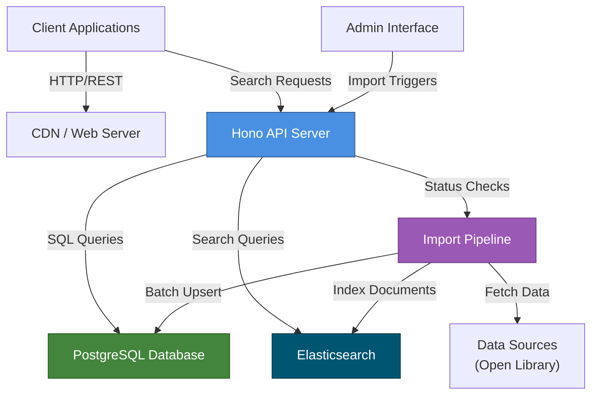
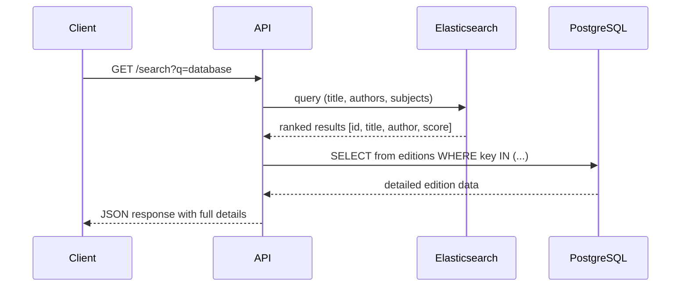
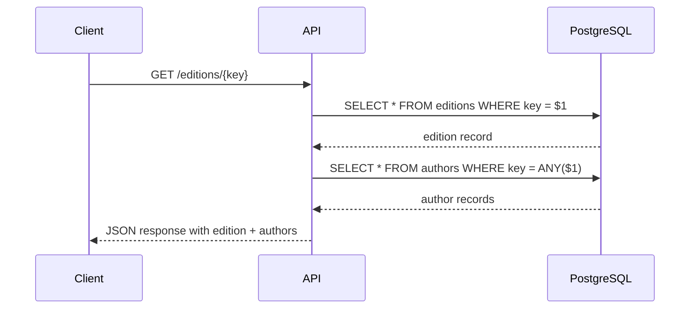

# System Design

Complete architectural overview of Echo Alexandria, the bibliographic data aggregation and search platform.

## High-Level Architecture



## Component Responsibilities

### API Server (Hono)

The Hono web framework serves as the primary interface for all external clients.

**Responsibilities:**
- Handle HTTP requests and responses with minimal overhead
- Route search queries to the appropriate endpoint
- Query PostgreSQL for catalog data (books, authors, editions)
- Forward search requests to Elasticsearch
- Provide import job management endpoints
- Stream responses for large datasets
- Validate and sanitize request parameters

**Key Design Patterns:**
- Route-based handler organization
- Middleware for logging and error handling
- WebSocket support for real-time job status updates
- Content negotiation for JSON responses

### PostgreSQL Database

The authoritative data store for all bibliographic information.

**Responsibilities:**
- Persist authors, works, and editions data
- Maintain import job history and status
- Enforce data integrity through PRIMARY KEYs
- Support efficient lookups via B-tree indexes
- Enable full-text search via GIN tsvector indexes
- Support array containment queries with GIN array indexes
- Store raw data for future extensibility

**Key Design Patterns:**
- Normalized schema with denormalized array references
- JSONB raw_data for schema flexibility
- Timestamp tracking for auditing and synchronization
- Array types for cardinality relationships

### Elasticsearch Cluster

High-performance full-text search and relevance ranking.

**Responsibilities:**
- Provide full-text search across titles, author names, and descriptions
- Support fuzzy matching and typo tolerance
- Rank results by relevance using TF-IDF
- Enable accent-insensitive searching (accents stripped during analysis)
- Provide autocomplete and suggestion capabilities
- Support filtering and faceting

**Key Design Patterns:**
- Custom analyzers for language-specific tokenization
- Multi-field mappings for different query types
- Keyword fields for exact matching
- Integer fields for metadata filtering

### Import Pipeline

Automated background process for data synchronization.

**Responsibilities:**
- Fetch data from external sources (Open Library)
- Transform and normalize incoming data
- Batch process records for efficiency
- Perform upsert operations to merge new and existing data
- Maintain import job history in PostgreSQL
- Refresh Elasticsearch indices with updated data
- Handle errors and provide detailed failure reporting

**Key Design Patterns:**
- Batch processing with configurable batch size (1,000 records)
- Transactional upserts with conflict resolution
- Job-based tracking for monitoring and auditing
- Idempotent operations for safe retries

## Technology Stack Rationale

### Bun Runtime

**Why Bun?**
- **3-4x faster I/O operations** compared to Node.js due to native binding to system APIs
- **Native TypeScript support** eliminates compilation step overhead
- **Integrated tooling** (bundler, test runner, package manager) reduces dependency hell
- **Built-in SQLite and Redis support** provides all-in-one runtime
- **Optimal for I/O-bound workloads** like data import and search operations
- **Smaller memory footprint** enables efficient resource utilization

### Hono Framework

**Why Hono?**
- **Lightweight and fast** with minimal overhead perfect for APIs
- **Bun-optimized** with native support and zero-copy responses
- **Routing elegance** with path parameters and wildcard support
- **Middleware system** for composable request handling
- **WebSocket support** for real-time features
- **Zero-dependency core** reduces attack surface and maintenance burden

### PostgreSQL 17

**Why PostgreSQL?**
- **Full-text search** with GIN tsvector indexes for linguistic analysis
- **JSONB support** for flexible schema evolution (raw_data column)
- **Array types** enable efficient denormalized relationships
- **GIN indexes** for both text search and array containment queries
- **ACID guarantees** ensure data consistency during imports
- **Battle-tested** with decades of production usage
- **Advanced features** like window functions for complex queries

### Elasticsearch 8.11

**Why Elasticsearch?**
- **Relevance ranking** using TF-IDF and BM25 algorithms
- **Full-text capabilities** with language-specific analyzers
- **Distributed architecture** for horizontal scaling
- **Real-time indexing** enables fresh search results
- **Complex queries** supporting boolean logic and range queries
- **Performance** at scale with optimized inverted indexes
- **Faceting and aggregations** for rich search interfaces

### Drizzle ORM

**Why Drizzle?**
- **Type-safe SQL generation** catches errors at compile time
- **Schema-first approach** makes migrations explicit and auditable
- **Zero-runtime overhead** compared to runtime query builders
- **SQL familiarity** for developers comfortable with raw SQL
- **Migration tooling** with drizzle-kit for schema versioning
- **Inline relations** reduce N+1 query problems

## Design Principles

### 1. Streaming-Oriented

Data flows through the system as streams rather than loading entire datasets into memory.

```
Data Source → [Batch] → PostgreSQL → Elasticsearch
    ↓           ↓            ↓            ↓
  Fetch      Transform    Persist      Index
```

**Benefits:**
- Handles datasets larger than available RAM
- Reduces latency for large imports
- Minimizes memory pressure on production systems

### 2. Batch Processing

Records are grouped into batches before database operations.

**Implementation:**
- Batch size: 1,000 records (configurable)
- Reduces round-trip overhead with database
- Enables efficient upsert operations
- Improves throughput by 10-100x

### 3. Upsert Pattern

All data modifications use upsert (insert-or-update) semantics.

**Advantages:**
- **Idempotent operations** safe to retry without side effects
- **Automatic deduplication** handles duplicate data sources
- **Merge capability** combines partial information from multiple sources

### 4. Eventual Consistency

PostgreSQL is the source of truth; Elasticsearch is a derived view.

```
PostgreSQL (ACID) → [Sync] → Elasticsearch (Eventually Consistent)
```

**Implications:**
- Search results may lag behind updates by seconds
- Simple recovery: delete and reindex from PostgreSQL
- No dual-write consistency problems

### 5. JSONB for Extensibility

Raw source data preserved in JSONB columns for future flexibility.

**Benefits:**
- Add new fields without database migration
- Support multiple data source formats simultaneously
- Archive original data for debugging and auditing

## Request Flows

### Search Request Flow



**Flow Steps:**
1. Client sends search query to API
2. API translates query to Elasticsearch DSL
3. Elasticsearch returns ranked list of document IDs
4. API fetches detailed data from PostgreSQL for top results
5. Combines relevance scores with full document data
6. Returns enriched results to client

**Optimization:**
- Pagination limits PostgreSQL fetch to top N results
- Elasticsearch caching improves repeated query performance
- Connection pooling prevents database bottlenecks

### Catalog Request Flow



**Flow Steps:**
1. Client requests specific edition by key
2. API queries PostgreSQL with primary key lookup
3. B-tree index provides O(log n) retrieval
4. For related authors, use array membership query
5. PostgreSQL GIN index speeds author lookups
6. Combine results and return

**Performance Characteristics:**
- Single primary key lookup: < 1ms
- Author lookups via GIN index: < 5ms
- Total response time: < 10ms (typical)

## Import Flow

The import pipeline follows an 8-phase process:


**Phase Details:**

| Phase | Duration | Input | Output | Recovery |
|-------|----------|-------|--------|----------|
| 1. Fetch | Variable | API endpoint | Raw records | Resume from offset |
| 2. Transform | Linear | Raw records | Normalized fields | Replay transformation |
| 3. Validate | Linear | Normalized | Valid records | Log invalid items |
| 4. Upsert DB | O(n/batch) | Valid records | Persisted in PostgreSQL | Rollback transaction |
| 5. Transform ES | Linear | DB records | ES document format | Replay formatting |
| 6. Batch Index | O(n/batch) | ES documents | Indexed in Elasticsearch | Reindex from DB |
| 7. Job Update | Constant | Results | Job record updated | Update retry logic |
| 8. Health Check | Constant | All systems | Status report | Alert and notify |

## Scalability Considerations

### Database Scaling

**Current Setup:**
- Single PostgreSQL instance
- B-tree indexes on search columns
- GIN indexes for text and array queries

**Scaling Path:**
1. **Read replicas** for read-heavy search queries
2. **Partitioning** editions table by first publish date
3. **Archival** of old import jobs
4. **Sharding** by author key for multi-region deployment

**Index Management:**
```
Current: authors_name_idx (B-tree)
         editions_title_idx (B-tree)
Scaling: Add partial indexes on frequently filtered columns
         Parallel index creation during low-traffic windows
```

### Search Scaling

**Current Setup:**
- Single Elasticsearch node (1 shard, 0 replicas)
- In-memory field caching

**Scaling Path:**
1. **Add replicas** for high availability (3-5 nodes)
2. **Shard by data type** (separate indices for editions, authors)
3. **Rolling upgrades** for zero-downtime updates
4. **Curator plugin** for index lifecycle management

**Performance Tuning:**
- Increase `number_of_replicas: 1-2` for redundancy
- Enable `refresh_interval: 30s` to batch updates
- Use `bulk` API for batch indexing

### Application Scaling

**Horizontal Scaling:**
- Load balance across multiple Hono instances
- Shared PostgreSQL and Elasticsearch clusters
- Sticky sessions for WebSocket connections (if added)

**Vertical Scaling:**
- Increase Bun process memory limit
- Enable connection pooling with higher limits
- Profile with Bun's built-in profiler

## System Boundaries

### External Dependencies

```
Echo Alexandria
├─ Data Sources
│  └─ Open Library API (read-only)
├─ PostgreSQL 17
│  ├─ TCP/5432
│  └─ Database: echo_alexandria
├─ Elasticsearch 8.11
│  ├─ HTTP/9200
│  └─ Cluster: es-cluster
└─ Admin Interface
   └─ HTTPS access
```

### Service Dependencies

**Required for Operation:**
- PostgreSQL 17+ (database)
- Elasticsearch 8.x (search)
- Network connectivity to Open Library (imports)

**Optional:**
- Redis (for caching, future enhancement)
- Prometheus (for metrics, future enhancement)

### Error Boundaries

**Database Errors:**
- Connection failures: Graceful degradation, retry with backoff
- Constraint violations: Log and skip malformed records
- Transaction rollback: Entire batch reprocessed

**Elasticsearch Errors:**
- Connection failures: Queue documents, retry indexing
- Mapping mismatches: Validate schema before bulk index
- Out of memory: Reduce batch size, process serially

**Import Errors:**
- Network timeouts: Exponential backoff with jitter
- Data validation: Log invalid records, continue processing
- Job failures: Store error details, enable manual retry

## Data Consistency Model

### Strong Consistency (PostgreSQL)

PostgreSQL provides ACID guarantees:
- **Atomicity:** Transaction succeeds fully or not at all
- **Consistency:** Constraints enforced (PRIMARY KEY, array types)
- **Isolation:** No dirty reads from concurrent transactions
- **Durability:** Data survives system failures

**Application:** All authoritative data and job tracking

### Eventual Consistency (Elasticsearch)

Elasticsearch indices lag behind PostgreSQL:
- **Latency:** 0-30 seconds typical
- **Recovery:** Delete and reindex from PostgreSQL
- **Correctness:** Search results never stale by >N generations

**Application:** All search indices and full-text data

### Handling Inconsistency

**During Normal Operation:**
- Acknowledge to users that search is eventually consistent
- Display search result "as of [timestamp]"

**After Outages:**
```
Elasticsearch Fails
  ↓
Stop indexing new documents
  ↓
Pause import jobs (keep DB write going)
  ↓
Restore Elasticsearch from backup
  ↓
Full reindex from PostgreSQL
  ↓
Resume normal operations
```

## Monitoring and Observability

### Key Metrics

**Database Health:**
- Active connections
- Query latency (P50, P95, P99)
- Cache hit ratio
- Index bloat percentage

**Search Health:**
- Query latency
- Index size
- Document count
- Failed queries

**Import Pipeline:**
- Records processed per second
- Error rate
- Batch processing time
- Job completion time

### Health Checks

```
/health/ready
├─ PostgreSQL connection: OK
├─ Elasticsearch connection: OK
└─ Application startup: complete

/health/live
├─ Request rate: active
└─ No stuck threads: verified
```

## Disaster Recovery

### Backup Strategy

```
Daily: PostgreSQL full backup → S3
Hourly: Elasticsearch snapshot → S3
On-demand: Point-in-time recovery for last 7 days
```

### Recovery Procedures

**PostgreSQL Data Loss:**
1. Stop application
2. Restore from daily backup
3. Apply transaction logs to recover missing data
4. Verify data consistency
5. Restart application

**Elasticsearch Loss:**
1. Trigger full reindex from PostgreSQL
2. Stream documents to Elasticsearch in batches
3. Verify index statistics match expected counts
4. Resume normal operations

## Security Considerations

### Input Validation

- Parameterized queries prevent SQL injection
- Request size limits prevent DoS
- JSON schema validation for POST bodies

### Authentication (Future)

- API key management for programmatic access
- Session-based auth for admin interface
- HTTPS-only communication

### Data Protection

- Encrypt PostgreSQL backup files
- TLS for Elasticsearch communication
- JSONB raw_data sanitized before exposure

---

**See Also:**
- [Database Schema](/docs/architecture/database-schema) - Detailed table definitions
- [Elasticsearch Indices](/docs/architecture/elasticsearch-indices) - Search configuration
- [Technology Stack](/docs/architecture/technology-stack) - Dependency details
- [Data Flow](/docs/architecture/data-flow) - Request/response sequences
