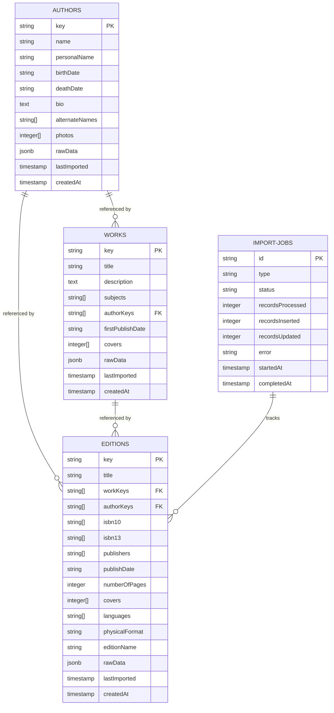
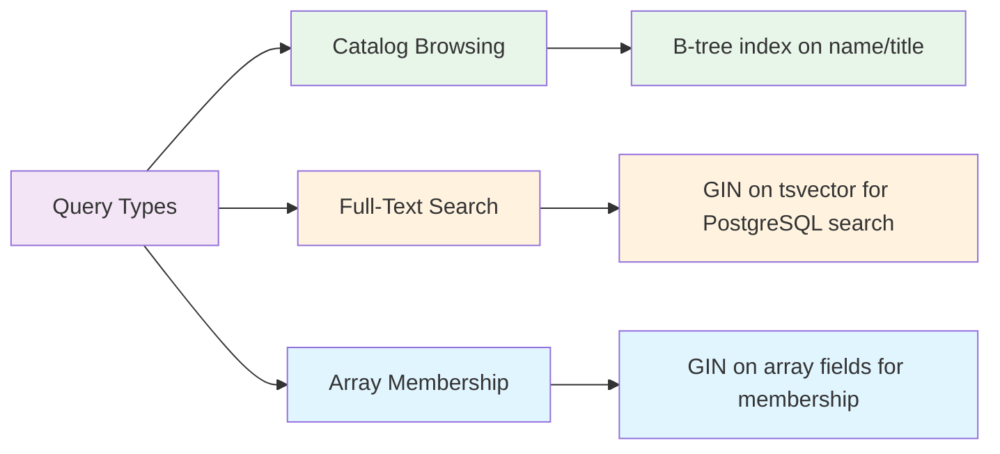

# Data Model

Comprehensive reference for Echo Alexandria's database schema and data relationships.

## Schema Overview

Echo Alexandria uses four primary tables in PostgreSQL to store OpenLibrary data:



## Table Definitions

### Authors Table

Stores author metadata from OpenLibrary.

```sql
CREATE TABLE authors (
    key TEXT PRIMARY KEY,                    -- e.g., "/authors/OL23919A"
    name TEXT NOT NULL,                      -- Author's display name
    personal_name TEXT,                      -- Birth name if different
    birth_date TEXT,                         -- Birth date (format varies)
    death_date TEXT,                         -- Death date (format varies)
    bio TEXT,                                -- Biography text
    alternate_names TEXT[],                  -- Alternative name spellings
    photos INTEGER[],                        -- OpenLibrary cover IDs
    raw_data JSONB,                          -- Complete JSON from OpenLibrary
    last_imported TIMESTAMP NOT NULL,        -- Last import time
    created_at TIMESTAMP NOT NULL            -- Record creation time
);

-- Indexes
CREATE INDEX authors_name_idx ON authors (name);
CREATE INDEX authors_name_gin_idx ON authors USING GIN(to_tsvector('english', name));
```

#### Authors Fields

| Field | Type | Nullable | Description | Example |
|-------|------|----------|-------------|---------|
| `key` | text | NO | OpenLibrary unique identifier | `/authors/OL45883A` |
| `name` | text | NO | Author's primary name | `J. R. R. Tolkien` |
| `personalName` | text | YES | Birth/legal name | `John Ronald Reuel Tolkien` |
| `birthDate` | text | YES | Birth date (varies in format) | `1892-01-03` |
| `deathDate` | text | YES | Death date | `1973-09-02` |
| `bio` | text | YES | Biography or description | `English writer and professor...` |
| `alternateNames` | text[] | YES | Alternative spellings/names | `{Tolkien, J.R.R. Tolkien}` |
| `photos` | integer[] | YES | OpenLibrary cover IDs | `{6979861, 7891234}` |
| `rawData` | jsonb | YES | Raw JSON from OpenLibrary | Full JSON object |
| `lastImported` | timestamp | NO | Last import date/time | `2024-01-15 10:30:00` |
| `createdAt` | timestamp | NO | Record creation date/time | `2024-01-15 10:30:00` |

#### Indexing Strategy

- **B-tree on `name`**: Speeds up catalog browsing and simple queries
- **GIN on name (tsvector)**: Enables full-text search in PostgreSQL

### Works Table

Stores work metadata (conceptual works, not physical editions).

```sql
CREATE TABLE works (
    key TEXT PRIMARY KEY,                    -- e.g., "/works/OL45804W"
    title TEXT NOT NULL,                     -- Work title
    description TEXT,                        -- Work summary/synopsis
    subjects TEXT[],                         -- Subject tags
    author_keys TEXT[],                      -- Array of author keys (FK)
    first_publish_date TEXT,                 -- First publication date
    covers INTEGER[],                        -- OpenLibrary cover IDs
    raw_data JSONB,                          -- Complete JSON from OpenLibrary
    last_imported TIMESTAMP NOT NULL,        -- Last import time
    created_at TIMESTAMP NOT NULL            -- Record creation time
);

-- Indexes
CREATE INDEX works_title_idx ON works (title);
CREATE INDEX works_title_gin_idx ON works USING GIN(to_tsvector('english', title));
CREATE INDEX works_author_keys_idx ON works USING GIN(author_keys);
```

#### Works Fields

| Field | Type | Nullable | Description | Example |
|-------|------|----------|-------------|---------|
| `key` | text | NO | OpenLibrary unique identifier | `/works/OL45804W` |
| `title` | text | NO | Work title | `The Lord of the Rings` |
| `description` | text | YES | Synopsis or description | `An epic high-fantasy novel...` |
| `subjects` | text[] | YES | Subject classifications | `{Fantasy, Adventure, Epic}` |
| `authorKeys` | text[] | YES | Array of author OpenLibrary IDs | `{/authors/OL45883A}` |
| `firstPublishDate` | text | YES | Original publication date | `1954` |
| `covers` | integer[] | YES | OpenLibrary cover IDs | `{6979861}` |
| `rawData` | jsonb | YES | Raw JSON from OpenLibrary | Full JSON object |
| `lastImported` | timestamp | NO | Last import date/time | `2024-01-15 10:30:00` |
| `createdAt` | timestamp | NO | Record creation date/time | `2024-01-15 10:30:00` |

#### Relationship to Authors

- **Foreign key**: `author_keys` array references `authors.key`
- **Not enforced**: Database doesn't enforce FK constraints on arrays (PostgreSQL limitation)
- **Application responsibility**: Import process ensures referential integrity

#### Indexing Strategy

- **B-tree on `title`**: Catalog browsing
- **GIN on title (tsvector)**: PostgreSQL full-text search
- **GIN on `authorKeys` array**: Efficient queries like "all works by author X"

### Editions Table

Stores individual book editions (primary entity for user tracking).

```sql
CREATE TABLE editions (
    key TEXT PRIMARY KEY,                    -- e.g., "/books/OL7353617M"
    title TEXT NOT NULL,                     -- Edition title
    work_keys TEXT[],                        -- Array of work keys (FK)
    author_keys TEXT[],                      -- Array of author keys (FK)
    isbn_10 TEXT[],                          -- ISBN-10 identifiers
    isbn_13 TEXT[],                          -- ISBN-13 identifiers
    publishers TEXT[],                       -- Publisher names
    publish_date TEXT,                       -- Publication date
    number_of_pages INTEGER,                 -- Page count
    covers INTEGER[],                        -- OpenLibrary cover IDs
    languages TEXT[],                        -- Language codes (e.g., "/languages/eng")
    physical_format TEXT,                    -- Format (hardcover, paperback, etc)
    edition_name TEXT,                       -- Edition specific name
    raw_data JSONB,                          -- Complete JSON from OpenLibrary
    last_imported TIMESTAMP NOT NULL,        -- Last import time
    created_at TIMESTAMP NOT NULL            -- Record creation time
);

-- Indexes
CREATE INDEX editions_title_idx ON editions (title);
CREATE INDEX editions_title_gin_idx ON editions USING GIN(to_tsvector('english', title));
CREATE INDEX editions_isbn10_idx ON editions USING GIN(isbn_10);
CREATE INDEX editions_isbn13_idx ON editions USING GIN(isbn_13);
CREATE INDEX editions_work_keys_idx ON editions USING GIN(work_keys);
CREATE INDEX editions_author_keys_idx ON editions USING GIN(author_keys);
```

#### Editions Fields

| Field | Type | Nullable | Description | Example |
|-------|------|----------|-------------|---------|
| `key` | text | NO | OpenLibrary unique identifier | `/books/OL7353617M` |
| `title` | text | NO | Edition title (may differ from work) | `The Hobbit (2012 edition)` |
| `workKeys` | text[] | YES | Array of work OpenLibrary IDs | `{/works/OL45804W}` |
| `authorKeys` | text[] | YES | Array of author OpenLibrary IDs | `{/authors/OL45883A}` |
| `isbn10` | text[] | YES | ISBN-10 numbers | `{0547928246}` |
| `isbn13` | text[] | YES | ISBN-13 numbers | `{9780547928241}` |
| `publishers` | text[] | YES | Publisher names | `{Houghton Mifflin Harcourt}` |
| `publishDate` | text | YES | Publication date (format varies) | `2012` |
| `numberOfPages` | integer | YES | Page count | `300` |
| `covers` | integer[] | YES | OpenLibrary cover IDs | `{6979861}` |
| `languages` | text[] | YES | Language keys from OpenLibrary | `{/languages/eng}` |
| `physicalFormat` | text | YES | Format description | `Hardcover` |
| `editionName` | text | YES | Edition-specific designation | `50th Anniversary Edition` |
| `rawData` | jsonb | YES | Raw JSON from OpenLibrary | Full JSON object |
| `lastImported` | timestamp | NO | Last import date/time | `2024-01-15 10:30:00` |
| `createdAt` | timestamp | NO | Record creation date/time | `2024-01-15 10:30:00` |

#### Why Editions Are Most Important

Editions are the primary entity users track because they represent specific, purchasable books:

- **Unique ISBNs**: Each edition has distinct ISBN-10/ISBN-13
- **Different formats**: Hardcover vs. paperback, different publishers
- **Variant titles**: "The Hobbit vs. The Hobbit (illustrated)"
- **User association**: When a user marks "I read The Hobbit 2012 edition"

#### Indexing Strategy

- **B-tree on `title`**: For sorting and basic queries
- **GIN on title (tsvector)**: Full-text search (most common operation)
- **GIN on ISBN arrays**: ISBN lookups like "find edition by ISBN"
- **GIN on key arrays**: Relationship navigation (all editions of a work)

### ImportJobs Table

Tracks all import operations for monitoring and auditing.

```sql
CREATE TABLE import_jobs (
    id TEXT PRIMARY KEY,                     -- UUID
    type TEXT NOT NULL,                      -- "authors" | "works" | "editions"
    status TEXT NOT NULL,                    -- "running" | "completed" | "failed"
    records_processed INTEGER DEFAULT 0,     -- Lines parsed from dump
    records_inserted INTEGER DEFAULT 0,      -- Records inserted/updated
    records_updated INTEGER DEFAULT 0,       -- Conflict updates
    error TEXT,                              -- Error message if failed
    started_at TIMESTAMP NOT NULL,           -- Start time
    completed_at TIMESTAMP,                  -- Completion time (null if running)
);

-- Indexes
CREATE INDEX import_jobs_type_idx ON import_jobs (type);
CREATE INDEX import_jobs_status_idx ON import_jobs (status);
CREATE INDEX import_jobs_started_at_idx ON import_jobs (started_at);
```

#### ImportJobs Fields

| Field | Type | Nullable | Description | Example |
|-------|------|----------|-------------|---------|
| `id` | text | NO | Unique job identifier (UUID) | `550e8400-e29b-41d4-a716-446655440000` |
| `type` | text | NO | Import type | `authors`, `works`, or `editions` |
| `status` | text | NO | Current status | `running`, `completed`, or `failed` |
| `recordsProcessed` | integer | YES | Total lines parsed from dump | `2000000` |
| `recordsInserted` | integer | YES | Records inserted/updated in DB | `1950000` |
| `recordsUpdated` | integer | YES | Records that were updates (conflict) | `50000` |
| `error` | text | YES | Error message if failed | `Connection timeout after 2 hours` |
| `startedAt` | timestamp | NO | Job start time | `2024-01-15 10:30:00` |
| `completedAt` | timestamp | YES | Job completion time | `2024-01-15 14:30:00` |

#### Job Status Lifecycle

```
running ─┬→ completed (successful)
         └→ failed (error occurred)
```

## Data Relationships

### Author-to-Work Relationship

```sql
-- Works reference Authors through author_keys array
SELECT w.title, a.name
FROM works w, LATERAL UNNEST(w.author_keys) AS wak
JOIN authors a ON a.key = wak
WHERE w.key = '/works/OL45804W';
```

- One author can have many works
- One work can have many authors
- Array field allows multiple references without join table

### Work-to-Edition Relationship

```sql
-- Editions reference Works through work_keys array
SELECT e.title, w.title
FROM editions e, LATERAL UNNEST(e.work_keys) AS ewk
JOIN works w ON w.key = ewk
WHERE e.key = '/books/OL7353617M';
```

- One work can have many editions
- One edition typically references one work (but supports multiple)
- Different formats, translations, reprints of same work

### Direct Author-to-Edition Relationship

```sql
-- Editions also directly reference Authors
SELECT e.title, a.name
FROM editions e, LATERAL UNNEST(e.author_keys) AS eak
JOIN authors a ON a.key = eak
WHERE e.key = '/books/OL7353617M';
```

- Allows direct edition→author navigation without going through works
- Denormalization for performance (common query path)

## Raw Data Storage (JSONB)

Each table includes a `rawData` JSONB field storing the complete JSON from OpenLibrary.

### Purpose

- **Future extensibility**: New fields can be extracted without schema migrations
- **Historical reference**: Complete data preserved as received
- **Debugging**: Compare processed fields with original JSON

### Example Author Raw Data

```json
{
  "name": "J. R. R. Tolkien",
  "personal_name": "John Ronald Reuel Tolkien",
  "birth_date": "1892-01-03",
  "death_date": "1973-09-02",
  "fuller_name": "John Ronald Reuel Tolkien, CBE",
  "type": {
    "key": "/type/author"
  },
  "entity_type": "person",
  "bio": {
    "type": "/type/text",
    "value": "English writer, poet, and academic..."
  },
  "photos": [6979861],
  "links": [
    {
      "title": "J.R.R. Tolkien",
      "url": "https://en.wikipedia.org/wiki/J.R.R._Tolkien",
      "type": {
        "key": "/type/link"
      }
    }
  ],
  "wikipedia": "https://en.wikipedia.org/wiki/J.R.R._Tolkien"
}
```

## Indexing Strategy Summary

### Why Multiple Indexes?

Echo Alexandria uses multiple index types to optimize different query patterns:



### Index Performance Characteristics

| Index Type | Best For | Size | Query Speed |
|------------|----------|------|-------------|
| B-tree on field | Exact matches, sorting | Small | Very fast |
| GIN on tsvector | Full-text search | Medium | Fast (100-500ms) |
| GIN on array | Array membership | Medium | Fast (50-200ms) |

### When Each Index Is Used

**B-tree indexes:**
```sql
-- Catalog browsing with limit/offset
SELECT * FROM authors ORDER BY name LIMIT 50 OFFSET 0;
```

**GIN tsvector indexes:**
```sql
-- Full-text search (still used by Elasticsearch import)
SELECT * FROM authors WHERE to_tsvector('english', name) @@ plainto_tsquery('english', 'tolkien');
```

**GIN array indexes:**
```sql
-- Find all editions by specific author
SELECT * FROM editions WHERE author_keys @> ARRAY['/authors/OL45883A'];
```

## Data Import and Upsert Strategy

### Upsert Pattern

When importing, all inserts use PostgreSQL's `ON CONFLICT DO UPDATE` clause:

```typescript
// Example from code
await db
  .insert(editions)
  .values(editionRecords)
  .onConflictDoUpdate({
    target: editions.key,
    set: {
      title: sql`EXCLUDED.title`,
      workKeys: sql`EXCLUDED.work_keys`,
      // ... all fields updated
      lastImported: sql`EXCLUDED.last_imported`,
    },
  });
```

### Benefits of Upsert

1. **Idempotent**: Re-running import with same data is safe
2. **Update tracking**: `lastImported` field shows when data was last refreshed
3. **No duplicates**: Conflicts resolved gracefully (no error thrown)
4. **Fast**: Single database round-trip

### Conflict Resolution Details

| Scenario | Behavior |
|----------|----------|
| New record (key not exists) | INSERT |
| Record exists (key matches) | UPDATE all fields, set lastImported to now |
| Partial data | All fields overwritten (use rawData for preservation) |

## Data Types and Constraints

### Text vs. JSONB

- **Text fields** (name, title): Indexed, queryable, searched
- **Text arrays**: For enumerations (isbn10, publishers, languages)
- **JSONB field** (rawData): Stores complete nested JSON, not indexed for search

### Optional Fields

Most fields are nullable (`TEXT`, `INTEGER` can be NULL) because:
- Not all books have all metadata
- OpenLibrary data completeness varies
- Future-proofs against missing fields

### Array Fields

PostgreSQL arrays provide:
- Type safety (TEXT[] enforced by database)
- GIN indexing for membership queries
- No separate join table needed
- Simple query syntax with `@>` and `@<` operators

## Cascading and Data Integrity

### No Database Constraints

Echo Alexandria does NOT use database foreign key constraints because:

1. **Arrays can't be constrained**: PostgreSQL arrays lack FK support
2. **OpenLibrary data varies**: Not all references are valid (deleted authors, etc)
3. **Import flexibility**: Can import in any order, add constraints later

### Application-Level Integrity

The import pipeline ensures integrity through careful ordering:

1. **Import authors first**: Create all author records
2. **Import works second**: Author references valid
3. **Import editions last**: Author and work references valid

## Capacity and Scale

### Typical Volumes

| Table | Estimated Records | Storage | Growth Rate |
|-------|-------------------|---------|------------|
| Authors | 2M+ | ~1GB | ~100K/month |
| Works | 5M+ | ~3GB | ~250K/month |
| Editions | 20M+ | ~20GB | ~1M/month |

### Index Storage

- Total indexes: ~30GB for full dataset
- Most index space used by GIN indexes (tsvector, arrays)
- B-tree indexes relatively small

## Querying Examples

### Find Author and Their Works

```typescript
// PostgreSQL + Drizzle
const author = await db.query.authors.findFirst({
  where: eq(authors.key, '/authors/OL45883A'),
});

const works = await db.query.works.findMany({
  where: inArray(works.authorKeys, [author.key]),
});
```

### Find All Editions of a Work

```typescript
const work = await db.query.works.findFirst({
  where: eq(works.key, '/works/OL45804W'),
});

const editions = await db.query.editions.findMany({
  where: inArray(editions.workKeys, [work.key]),
});
```

### Search Full-Text (PostgreSQL)

```typescript
const results = await db.query.editions.findMany({
  where: sql`to_tsvector('english', ${editions.title}) @@ plainto_tsquery('english', 'hobbit')`,
  limit: 20,
});
```

### Search by ISBN

```typescript
const edition = await db.query.editions.findFirst({
  where: inArray(editions.isbn13, ['9780547928241']),
});
```

## Related Documentation

- **[Overview](./overview.md)** - System architecture and design
- **[Import Pipeline](./import-pipeline.md)** - How data is imported
- **[Search Architecture](./search-architecture.md)** - How Elasticsearch is used
- **[API Reference](../api/catalog/editions.md)** - Catalog API documentation
