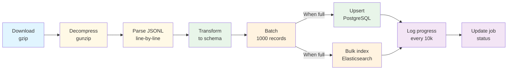
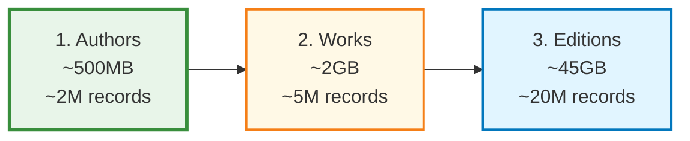
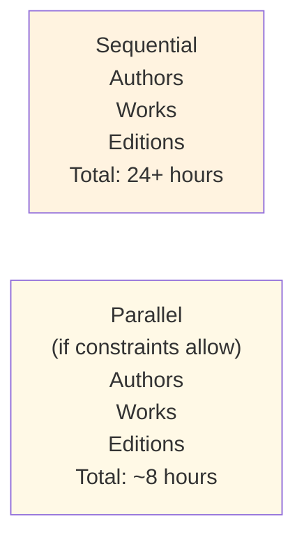

# Import Pipeline

Complete guide to Echo Alexandria's data import process from OpenLibrary.

## Overview

The import pipeline is a streaming batch processor that efficiently ingests OpenLibrary's massive data dumps (up to 45GB) into PostgreSQL and Elasticsearch. The process is optimized for:

- **Memory efficiency**: Streaming parser never loads entire file in memory
- **Performance**: 1,000-record batches optimize insert overhead vs. transaction cost
- **Resilience**: Malformed records skipped; single errors don't break entire import
- **Idempotence**: Upsert pattern makes restarts safe
- **Observability**: Real-time progress tracking every 10,000 records

## High-Level Flow



## Import Order (Strict Dependency)

Echo Alexandria enforces a specific import order to maintain referential integrity:



### Why This Order?

1. **Authors** (no dependencies)
   - Can import immediately
   - Smallest dump (~500MB)
   - Fast import (~5 minutes)

2. **Works** (depends on Authors)
   - References author keys via `authorKeys` array
   - Medium size (~2GB)
   - Takes ~30 minutes

3. **Editions** (depends on Authors and Works)
   - References both authors and works via arrays
   - Largest dump (~45GB)
   - Takes 24+ hours
   - Must complete authors and works first

### What Happens If Order Is Wrong?

```
Authors → Works → Editions ✓ CORRECT
- Authors exist before Works references them
- Works exist before Editions references them
- All foreign key references valid

Wrong Orders:
Editions → Works → Authors ✗ FAILS
- Edition references Authors/Works that don't exist yet
- Import can proceed but references may be invalid

Works → Authors → Editions ✗ FAILS
- Works reference Authors that don't exist yet
```

## Detailed Process Flow

### Phase 1: Download

```typescript
export async function downloadDump(
  type: "works" | "editions" | "authors"
): Promise<string>
```

**What it does:**
- Fetches gzip-compressed dump from OpenLibrary (`ol_dump_<type>_latest.txt.gz`)
- Streams response to avoid loading entire file in memory
- Decompresses using gunzip in pipeline
- Saves to `./data/<type>_latest.txt`

**URLs (latest snapshots):**
- Authors: `https://openlibrary.org/data/ol_dump_authors_latest.txt.gz`
- Works: `https://openlibrary.org/data/ol_dump_works_latest.txt.gz`
- Editions: `https://openlibrary.org/data/ol_dump_editions_latest.txt.gz`

**File sizes (approximate):**
- Authors: 500MB (compressed), 1GB (uncompressed)
- Works: 700MB (compressed), 2GB (uncompressed)
- Editions: 10GB (compressed), 45GB (uncompressed)

**Time estimates (100 Mbps connection):**
- Authors: 10 minutes download + 5 minutes decompress
- Works: 15 minutes download + 15 minutes decompress
- Editions: 2+ hours download + 1 hour decompress

### Phase 2: Parse

```typescript
export async function* parseDump(filePath: string): AsyncGenerator<DumpRecord>

interface DumpRecord {
  type: string;        // e.g., "/type/author"
  key: string;         // e.g., "/authors/OL45883A"
  revision: number;    // Edit revision number
  lastModified: string; // Last modification timestamp
  json: any;           // Complete OpenLibrary JSON object
}
```

**Format (tab-separated JSONL):**

OpenLibrary dumps use a simple but efficient format:

```
type\tkey\trevision\tlast_modified\tjson_payload
/type/author\t/authors/OL45883A\t12\t2024-01-15T10:30:00.000000\t{"name": "J. R. R. Tolkien", ...}
/type/author\t/authors/OL45883B\t5\t2024-01-10T14:22:00.000000\t{"name": "Isaac Asimov", ...}
```

**Parser behavior:**
- Reads line-by-line using Node.js readline interface
- Skips empty lines gracefully
- Parses tab-separated columns
- Deserializes JSON in 5th column
- Counts and logs malformed lines every 1,000 errors

**Error handling:**
```typescript
if (parts.length < 5) {
  skippedLines++;
  continue; // Skip malformed line, continue processing
}

try {
  const json = JSON.parse(jsonStr);
  yield { type, key, revision, lastModified, json };
} catch (error) {
  skippedLines++; // Log and skip bad JSON
  continue;
}
```

**Malformed line statistics:**
- Typically 0.01-0.1% of data
- Usually due to stray characters in OpenLibrary JSON
- Skipping is safe; data is regenerated in future dumps

### Phase 3: Transform

Each record type transforms OpenLibrary JSON to database schema:

#### Authors Transform

```typescript
// Input from OpenLibrary dump
{
  "name": "J. R. R. Tolkien",
  "personal_name": "John Ronald Reuel Tolkien",
  "birth_date": "1892-01-03",
  "death_date": "1973-09-02",
  "bio": { "type": "/type/text", "value": "..." },
  "photos": [6979861],
  "links": [...],
  ...
}

// Output to database
{
  key: "/authors/OL45883A",
  name: "J. R. R. Tolkien",
  personalName: "John Ronald Reuel Tolkien",
  birthDate: "1892-01-03",
  deathDate: "1973-09-02",
  bio: "English writer, poet, and academic...",
  alternateNames: ["Tolkien, J.R.R.", ...],
  photos: [6979861],
  rawData: { /* complete JSON */ },
  lastImported: new Date(),
}
```

**Transformation logic:**
- Extract simple fields directly (name, birthDate, etc.)
- Unwrap nested JSONB objects (bio.value → bio)
- Convert arrays (photos)
- Preserve complete JSON in rawData for future extraction

#### Works Transform

```typescript
// OpenLibrary JSON structure
{
  "title": "The Lord of the Rings",
  "description": { "type": "/type/text", "value": "..." },
  "authors": [
    { "author": { "key": "/authors/OL45883A" }, "type": "/type/author_role" }
  ],
  "first_publish_date": "1954",
  "subjects": ["Fantasy", "Epic"],
  "covers": [6979861],
  ...
}

// Database record
{
  key: "/works/OL45804W",
  title: "The Lord of the Rings",
  description: "An epic high-fantasy novel...",
  authorKeys: ["/authors/OL45883A"],
  firstPublishDate: "1954",
  subjects: ["Fantasy", "Epic"],
  covers: [6979861],
  rawData: { /* complete JSON */ },
  lastImported: new Date(),
}
```

**Key extraction:**
- Authors: Extract key from nested author object
- Multiple authors supported via array

#### Editions Transform

```typescript
// OpenLibrary JSON
{
  "title": "The Hobbit",
  "isbn_10": ["0547928246"],
  "isbn_13": ["9780547928241"],
  "works": [
    { "key": "/works/OL45804W" },
    { "key": "/works/OL45805W" }  // Sometimes multiple
  ],
  "authors": [
    { "author": { "key": "/authors/OL45883A" } }
  ],
  "publishers": ["Houghton Mifflin Harcourt"],
  "publish_date": "2012",
  "number_of_pages": 300,
  "languages": [{ "key": "/languages/eng" }],
  "physical_format": "Hardcover",
  "edition_name": "50th Anniversary Edition",
  "covers": [6979861],
  ...
}

// Database record
{
  key: "/books/OL7353617M",
  title: "The Hobbit",
  isbn10: ["0547928246"],
  isbn13: ["9780547928241"],
  workKeys: ["/works/OL45804W"],
  authorKeys: ["/authors/OL45883A"],
  publishers: ["Houghton Mifflin Harcourt"],
  publishDate: "2012",
  numberOfPages: 300,
  languages: ["/languages/eng"],
  physicalFormat: "Hardcover",
  editionName: "50th Anniversary Edition",
  covers: [6979861],
  rawData: { /* complete JSON */ },
  lastImported: new Date(),
}
```

**Complex extractions:**
- ISBN arrays: Handle both single string and array
- Work keys: Extract from works array
- Author keys: Nested extraction from author.key
- Languages: Extract key from language objects

### Phase 4: Batch & Insert

```typescript
class BatchInserter<T> {
  private batch: T[] = [];
  private readonly batchSize: number;
  private readonly insertFn: (items: T[]) => Promise<void>;

  async add(item: T) {
    this.batch.push(item);
    if (this.batch.length >= this.batchSize) {
      await this.flush();
    }
  }

  async flush() {
    if (this.batch.length === 0) return;
    await this.insertFn(this.batch);
    this.totalInserted += this.batch.length;
    this.batch = [];
  }
}
```

**Batch size: 1,000 records**

Why 1,000?
- **Memory**: 1,000 records typically ~1-2MB (safe to hold in memory)
- **Overhead**: Database round-trip overhead is significant; larger batches amortize cost
- **Failure isolation**: If batch 47 fails, we've still processed 46,000 records
- **Performance**: ~100ms per batch insertion = ~10,000 records/second

Alternative batch sizes:

| Size | Memory | Speed | Resilience |
|------|--------|-------|-----------|
| 100 | ~0.5MB | Slow (100 sec/1M) | High (more restarts) |
| **1,000** | ~1-2MB | **Good (10 sec/1M)** | **Balanced** |
| 10,000 | ~20MB | Fast (1 sec/1M) | Low (restart loses work) |
| 100,000 | ~200MB | Very fast | Poor (memory issues) |

### Phase 5: Upsert to PostgreSQL

```typescript
// For editions (same pattern for authors/works)
export async function upsertEditionsBatch(editionRecords: any[]) {
  if (editionRecords.length === 0) return;

  try {
    await db
      .insert(editions)
      .values(editionRecords)
      .onConflictDoUpdate({
        target: editions.key,
        set: {
          title: sql`EXCLUDED.title`,
          workKeys: sql`EXCLUDED.work_keys`,
          authorKeys: sql`EXCLUDED.author_keys`,
          // ... all other fields ...
          lastImported: sql`EXCLUDED.last_imported`,
        },
      });
  } catch (error) {
    console.error("Error upserting editions batch:", error);
    throw error;
  }
}
```

**PostgreSQL Upsert (`ON CONFLICT DO UPDATE`):**

```sql
INSERT INTO editions (key, title, work_keys, ...)
VALUES
  ('/books/OL1', 'Book 1', '{/works/OL1}', ...),
  ('/books/OL2', 'Book 2', '{/works/OL2}', ...),
  ...
ON CONFLICT (key) DO UPDATE SET
  title = EXCLUDED.title,
  work_keys = EXCLUDED.work_keys,
  ...
  last_imported = EXCLUDED.last_imported;
```

**Conflict resolution:**

| Case | Behavior |
|------|----------|
| New record | INSERT (key doesn't exist) |
| Existing record | UPDATE all fields from EXCLUDED |
| Duplicate in batch | Last value wins (PostgreSQL spec) |

**Why upsert instead of delete + insert?**

- **Idempotent**: Re-running doesn't create duplicates
- **Auditable**: `lastImported` tracks when data was refreshed
- **Fast**: Single round-trip, no delete overhead
- **Safe**: No data loss if import restarts mid-batch

### Phase 6: Bulk Index to Elasticsearch

```typescript
export async function bulkIndexEditions(editions: EditionDocument[]) {
  const operations: any[] = [];

  for (const edition of editions) {
    operations.push({ index: { _index: INDICES.EDITIONS } });
    operations.push({
      key: edition.key,
      title: edition.title,
      authors: resolvedAuthorNames, // Denormalized
      // ... other fields ...
    });
  }

  await es.bulk({ body: operations });
}
```

**Bulk API format:**

```json
POST _bulk
{ "index": { "_index": "editions" } }
{ "key": "/books/OL1", "title": "The Hobbit", ... }
{ "index": { "_index": "editions" } }
{ "key": "/books/OL2", "title": "Harry Potter", ... }
```

**Denormalization:**
- Editions index includes resolved author names (denormalized from authors table)
- Allows searching "edition by author" without joining tables
- Author names resolved from database before indexing

**Elasticsearch mapping (defined in `indices.ts`):**

```json
{
  "properties": {
    "key": { "type": "keyword" },
    "title": {
      "type": "text",
      "analyzer": "title_analyzer",
      "fields": {
        "keyword": { "type": "keyword" },
        "exact": { "type": "text", "analyzer": "standard" }
      }
    },
    "authors": {
      "type": "text",
      "fields": { "keyword": { "type": "keyword" } }
    },
    "isbn10": { "type": "keyword" },
    "isbn13": { "type": "keyword" },
    "publishers": { "type": "keyword" },
    // ... more fields ...
  }
}
```

### Phase 7: Progress Tracking

```typescript
const progress = new ProgressLogger("Editions", 10000);

// Logs every 10,000 records
progress.log(recordsProcessed);

// Example output:
// [Editions] Processed: 1,000,000 | Elapsed: 2m 15s | Rate: 7,407/s | Recent: 8,150/s
// [Editions] Processed: 2,000,000 | Elapsed: 4m 10s | Rate: 8,000/s | Recent: 8,750/s
```

**Metrics logged:**
- `Processed`: Total records seen so far
- `Elapsed`: Total time since start
- `Rate`: Average records/second for entire job
- `Recent`: Records/second in last interval

**Final summary:**
```
======================================================================
Editions import complete!
======================================================================
Total processed:        20,000,000
Total inserted/updated:  19,500,000
Total time:            4h 23m 15s
Average rate:          1,262 records/s
======================================================================
```

### Phase 8: Job Status Update

```typescript
// Create import job
await db.insert(importJobs).values({
  id: jobId,
  type: "editions",
  status: "running",
});

// Update as progress is made
// (typically every 100,000 records in production)

// On completion
await db
  .update(importJobs)
  .set({
    status: "completed",
    recordsProcessed: 20000000,
    recordsInserted: 19500000,
    completedAt: new Date(),
  })
  .where(eq(importJobs.id, jobId));

// Or on failure
await db
  .update(importJobs)
  .set({
    status: "failed",
    error: "Connection timeout after 3 hours",
    completedAt: new Date(),
  })
  .where(eq(importJobs.id, jobId));
```

## Performance Optimization

### Streaming vs. Loading Entire File

**Why streaming is critical:**

```
Editions dump: 45GB
Available RAM: 8GB
Available RAM for buffering: 2GB (after OS/app overhead)

Without streaming: IMPOSSIBLE (dump > RAM)
With streaming: ~5MB buffer per batch = works fine
```

### Batch Insert Optimization

**Cost breakdown for 20M records:**

```
Single inserts (1 record per query):
  20M queries × 5ms per query = 100,000 seconds = 28 hours

Batches of 1,000:
  20,000 batches × 100ms per batch = 2,000 seconds = 33 minutes

Batches of 10,000:
  2,000 batches × 500ms per batch = 1,000 seconds = 17 minutes

BUT: Batch of 10,000 = 20MB memory, higher failure risk
```

### Parallel Import Order

Currently sequential (Authors → Works → Editions), but could be parallelized:



Why not parallel?
- Works references Authors (can't start until authors done)
- Editions references Works and Authors (can't start until both done)
- But Works and Authors imports could theoretically run during editions import (different data)

## Resilience & Error Handling

### Resumable Imports

If an import fails:

```
Job fails after 5M records processed (batch 5000)
→ Database has 4,999,000 records successfully inserted
→ Elasticsearch has 4,999,000 documents indexed
→ next batch (5,000) was in progress when connection broke

Retry:
→ Run import again from start
→ Uses upsert, so first 5M records just update (idempotent)
→ Continues from record 5,000 onward (new inserts)
→ Final result: 20M records in database
```

### Malformed Record Handling

```typescript
// Parser gracefully skips bad records
for await (const line of rl) {
  try {
    const json = JSON.parse(jsonStr);
    yield { type, key, revision, lastModified, json };
  } catch (error) {
    skippedLines++; // Just count and skip
    if (skippedLines % 1000 === 0) {
      console.error(`Parse error at line ${lineNumber}`);
    }
    continue; // Continue to next record
  }
}
```

**Result:**
- 1 malformed record doesn't break entire import
- 0.01% data loss (typically < 2,000 records out of 20M)
- Data regenerated in next monthly dump

### Database Error Handling

```typescript
try {
  await upsertEditionsBatch(editionRecords);
} catch (error) {
  console.error("Error upserting editions batch:", error);
  // Batch fails completely
  // Job is marked failed
  // Can be retried by restarting import
  throw error;
}
```

**Per-batch isolation:**
- If batch 47 fails, batches 1-46 are already committed
- Only batch 47 needs to be retried
- Can resume from batch 48 (no data loss)

## Import Duration Estimates

### Authors Import

```
Dump size: 500MB
Records: 2M
Batch size: 1,000
Batches: 2,000

Timings:
  Download: ~5 min (@ 100 Mbps)
  Decompress: ~2 min
  Parse: ~2 min (2M records)
  Batch & Insert: ~3 min (2,000 batches @ 100ms)
  Elasticsearch index: ~2 min
  Total: ~14 minutes
```

### Works Import

```
Dump size: 2GB
Records: 5M
Download: ~15 min (@ 100 Mbps)
Decompress: ~15 min
Parse: ~4 min
Batch & Insert: ~8 min (5,000 batches @ 100ms)
Elasticsearch index: ~5 min
Total: ~47 minutes
```

### Editions Import

```
Dump size: 45GB
Records: 20M
Download: ~5+ hours (@ 100 Mbps)
  Note: OpenLibrary may throttle; actual: 10+ hours
Decompress: ~1 hour
Parse: ~8 min
Batch & Insert: ~30 min (20,000 batches @ 100ms)
Elasticsearch index: ~20 min
Total: 16+ hours download + 1 hour processing = 17+ hours

In practice: 24+ hours (due to network variability)
```

## Monitoring Imports

### Check Current Status

```bash
# Via API
curl -H "X-API-Key: your-api-key" \
  http://localhost:3001/api/admin/import/status/editions

# Response:
{
  "id": "550e8400-e29b-41d4-a716-446655440000",
  "type": "editions",
  "status": "running",
  "recordsProcessed": 5000000,
  "recordsInserted": 4950000,
  "recordsUpdated": 50000,
  "startedAt": "2024-01-15T10:30:00Z",
  "completedAt": null
}
```

### View Import History

```bash
# List recent imports (requires database access)
SELECT id, type, status, records_processed, started_at, completed_at
FROM import_jobs
ORDER BY started_at DESC
LIMIT 10;
```

### Monitor Elasticsearch Indexing

```bash
# Check Elasticsearch index stats
curl http://localhost:9200/editions/_stats

# Response includes:
{
  "primaries": {
    "docs": { "count": 19500000 },
    "store": { "size_in_bytes": 45000000000 }
  }
}
```

## Related Documentation

- **[Overview](./overview.md)** - System architecture
- **[Data Model](./data-model.md)** - Database schema
- **[Search Architecture](./search-architecture.md)** - Elasticsearch details
- **[Operations: Data Import](../operations/data-import.md)** - Operational guide
