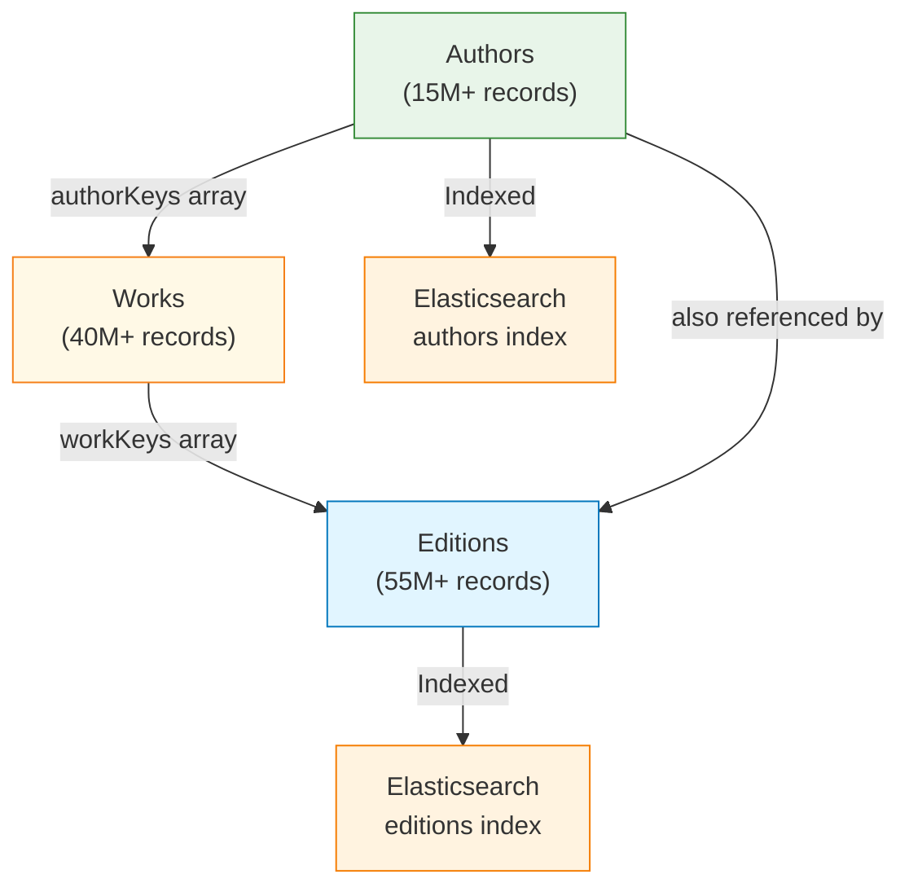
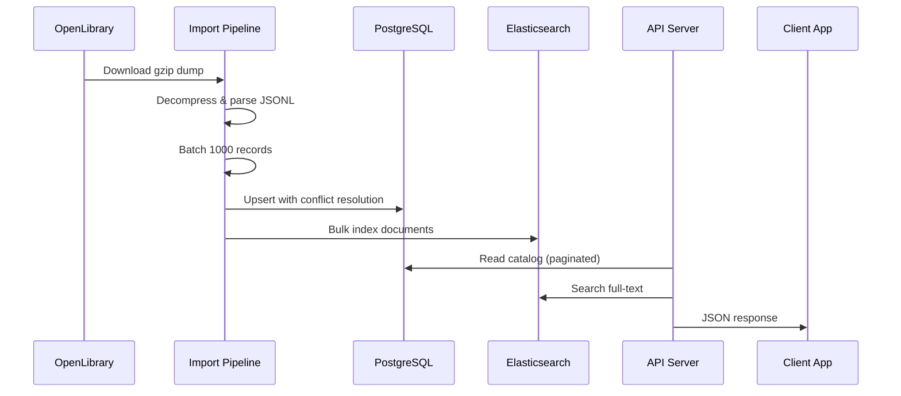
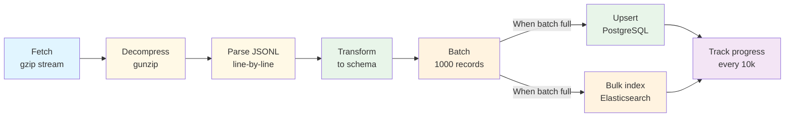

# Core Concepts Overview

Understanding Echo Alexandria's fundamental architecture and design principles.

## System Architecture

Echo Alexandria is a three-tier data pipeline system that imports book data from OpenLibrary, stores it in PostgreSQL, indexes it in Elasticsearch, and serves it via a REST API.


## Data Model Hierarchy

Echo Alexandria organizes book data in a hierarchical three-level model:



### Entity Relationships

**Authors** → **Works** → **Editions**

- An **Author** can have multiple **Works**
- A **Work** can have multiple **Editions** (different publications, translations, formats)
- An **Edition** references one or more **Works** and **Authors**

This hierarchy mirrors OpenLibrary's data model and enables efficient data management.

## Key Components

### 1. Data Storage Layer

**PostgreSQL 17** serves as the primary data store with strategic indexing:

- **B-tree indexes** on frequently queried fields (name, title)
- **GIN indexes** for full-text search using PostgreSQL's tsvector
- **GIN array indexes** for efficient foreign key lookups
- **JSONB storage** for complete raw OpenLibrary data (future extensibility)

### 2. Search Layer

**Elasticsearch 8.11** provides fast, relevance-ranked full-text search:

- **Two main indices**: editions_index, authors_index
- **Multi-field strategy**: keyword (exact), exact (phrase), and text (standard) fields
- **Custom analyzers**: Lowercase, ASCII-folding for accent-insensitive matching
- **Relevance boosting**: 4-tier scoring (exact > phrase > prefix > standard)

### 3. API Layer

**Hono framework** on Bun runtime delivers high-performance REST endpoints:

- **Search endpoints**: Fast Elasticsearch-backed search
- **Catalog endpoints**: Paginated PostgreSQL queries
- **Admin endpoints**: Protected import management
- **Health endpoints**: Service monitoring

### 4. Import Pipeline

Streaming import process optimized for multi-gigabyte OpenLibrary dumps:

- **Parallel downloads**: Authors, Works, Editions (strict dependency order)
- **Streaming parser**: JSONL format with tab-separated structure
- **Batch processing**: 1,000 records per batch for optimal performance
- **Progress tracking**: Real-time metrics every 10,000 records
- **Conflict resolution**: Upsert strategy for data updates

## Data Flow

### Complete Import Journey



### Import Order (Dependency-Driven)

1. **Authors** (smallest, ~500MB): No dependencies
2. **Works** (medium, ~2GB): Requires authors for foreign keys
3. **Editions** (largest, ~45GB): Requires authors and works for foreign keys

## Performance Characteristics

### Search Performance

| Operation | Response Time | Technology |
|-----------|---------------|-----------|
| Exact title match | 10-50ms | Elasticsearch keyword field |
| Phrase search | 20-100ms | Elasticsearch match_phrase |
| Prefix search | 30-150ms | Elasticsearch match_phrase_prefix |
| Standard search | 50-300ms | Elasticsearch match with boosting |
| Full dataset scan | 100-500ms | PostgreSQL sequential scan |

### Scalability Metrics

| Component | Capacity | Scaling Strategy |
|-----------|----------|------------------|
| Authors | 15M+ | GIN indexes on name |
| Works | 40M+ | GIN array indexes on authorKeys |
| Editions | 55M+ | Multiple GIN indexes + ES sharding |
| Concurrent requests | 100+ | Bun's async/await model |

## Technology Stack Rationale

### Why Bun?

- **Performance**: 3-4x faster than Node.js for file I/O (critical for streaming imports)
- **Native APIs**: Built-in SQLite, Redis, WebSocket support
- **All-in-one**: No additional tools needed (bundler, test runner, etc.)
- **TypeScript**: First-class TypeScript support without compilation step

### Why Hono?

- **Speed**: Ultra-lightweight framework (minimal overhead)
- **Simplicity**: Clean API for route definitions
- **Flexibility**: Works with any Bun/Node runtime
- **Minimal dependencies**: Reduces security surface

### Why PostgreSQL?

- **GIN indexes**: Specialized support for full-text search and array queries
- **JSONB**: Stores raw OpenLibrary data for future field extraction
- **Reliability**: ACID compliance ensures data integrity during bulk imports
- **Maturity**: 25+ years of production database experience

### Why Elasticsearch?

- **Full-text search**: Specialized for relevance ranking and phrase matching
- **Analyzers**: Custom text analysis (lowercase, accent removal)
- **Scalability**: Horizontal scaling via sharding
- **Performance**: Inverted indexes optimized for text queries (typically under 100ms)

## Import Pipeline Architecture

The import pipeline implements a **streaming batching pattern** optimized for multi-gigabyte datasets:



### Key Design Decisions

| Decision | Rationale |
|----------|-----------|
| **Streaming parser** | Handles 45GB+ editions dump without loading entire file in memory |
| **1000-record batches** | Optimal balance between write frequency (overhead) and memory usage |
| **Upsert pattern** | Idempotent imports - safe to retry without duplicates |
| **GIN indexes** | PostgreSQL's best option for full-text and array searches |
| **Separate indices** | Authors and editions have different search behavior and relevance needs |
| **Dependency order** | Authors first → Works second → Editions last (FK constraints) |

## Search Relevance Model

Echo Alexandria uses a **multi-tier relevance boosting** strategy to rank results by match quality:

| Tier | Boost | Example | Use Case |
|------|-------|---------|----------|
| Exact | 100 | "The Hobbit" = "The Hobbit" | Perfect match - user typing exact title |
| Phrase | 50 | Contains "The Hobbit" exactly | Title contains full query phrase |
| Prefix | 10 | Starts with "The Hob" | Auto-complete / partial typing |
| Standard | 1 | Contains all words | Flexible matching (any word order) |

**Example query**: "the hobbit"

```
Ranked results:
1. "The Hobbit" (exact match, boost: 100)
2. "The Hobbit: An Unexpected Journey" (phrase match, boost: 50)
3. "The Hobbit - Special Edition" (prefix match, boost: 10)
4. "Hobbit Tales" (standard match, boost: 1)
```

## Import Job Tracking

Every import operation is tracked via the `importJobs` table:

| Field | Type | Purpose |
|-------|------|---------|
| `id` | UUID | Unique job identifier |
| `type` | string | "authors" \| "works" \| "editions" |
| `status` | string | "running" \| "completed" \| "failed" |
| `recordsProcessed` | integer | Total lines parsed from dump |
| `recordsInserted` | integer | Records inserted/updated in database |
| `recordsUpdated` | integer | Conflict updates vs new inserts |
| `error` | string | Error message if failed |
| `startedAt` | timestamp | Job start time |
| `completedAt` | timestamp | Job completion time (null if running) |

Jobs enable monitoring, resumability, and historical auditing of import operations.

## Error Handling & Resilience

### Import Resilience

- **Streaming parser skips malformed records**: Single bad JSON line doesn't break entire import
- **Batch transaction isolation**: Each batch succeeds or fails independently
- **Upsert conflict resolution**: Duplicate keys update existing records rather than failing
- **Progress logging**: Regular milestones allow resuming from known point

### Search Fallbacks

- **Missing Elasticsearch**: API returns 500 error (clients should retry)
- **Empty search results**: Returns empty array (not an error)
- **Invalid query syntax**: Elasticsearch handles gracefully via query validation

## Best Practices for Using Echo Alexandria

### For Search Operations

1. **Use appropriate limits**: Request only what you need (default 20 is often sufficient)
2. **Implement debouncing**: Real-time search should debounce user input (300ms recommended)
3. **Cache results**: Client-side caching reduces redundant API calls
4. **Handle empty results**: Empty arrays are valid responses, not errors

### For Data Imports

1. **Import order matters**: Always import Authors → Works → Editions
2. **Monitor progress**: Check import job status for long-running operations
3. **Batch processing**: 1000-record batches are optimal; don't use larger batches
4. **Restart safely**: Upsert pattern makes restarts safe (no duplicates created)

### For Production Deployments

1. **Allocate sufficient memory**: 2GB+ for Elasticsearch, 1GB+ for PostgreSQL
2. **Use connection pooling**: Limit concurrent database connections
3. **Monitor import duration**: 24+ hours for complete editions import is normal
4. **Implement rate limiting**: Use reverse proxy (nginx/Cloudflare) for API protection

## Related Documentation

- **[Data Model](./data-model.md)** - Detailed schema and field descriptions
- **[Import Pipeline](./import-pipeline.md)** - Step-by-step import process
- **[Search Architecture](./search-architecture.md)** - Search implementation details
- **[API Reference](../api/overview.md)** - Complete API endpoint documentation
