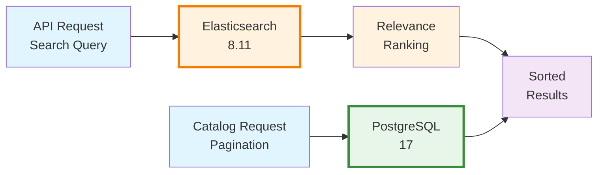

# Search Architecture

Deep dive into Echo Alexandria's Elasticsearch-powered search implementation.

## Overview

Echo Alexandria uses **Elasticsearch 8.11** as a specialized search layer, separate from the PostgreSQL catalog. While PostgreSQL provides indexed catalog browsing, Elasticsearch provides fast, relevance-ranked full-text search optimized for discovering books by title or author.



## Elasticsearch Indices

Echo Alexandria maintains two main Elasticsearch indices:

### Index Overview

| Index | Documents | Purpose | Update Frequency |
|-------|-----------|---------|-----------------|
| `editions` | 20M+ | Book edition search by title | Monthly |
| `authors` | 2M+ | Author search by name | Monthly |

### Editions Index

Stores searchable edition documents optimized for title and author discovery.

**Index Settings:**
```json
{
  "settings": {
    "number_of_shards": 1,
    "number_of_replicas": 0,
    "analysis": {
      "analyzer": {
        "title_analyzer": {
          "type": "custom",
          "tokenizer": "standard",
          "filter": ["lowercase", "asciifolding"]
        }
      }
    }
  }
}
```

**Field Mappings:**

```json
{
  "properties": {
    "key": { "type": "keyword" },
    "title": {
      "type": "text",
      "analyzer": "title_analyzer",
      "fields": {
        "keyword": { "type": "keyword" },
        "exact": { "type": "text", "analyzer": "standard" }
      }
    },
    "workKeys": { "type": "keyword" },
    "authorKeys": { "type": "keyword" },
    "authors": {
      "type": "text",
      "fields": { "keyword": { "type": "keyword" } }
    },
    "isbn10": { "type": "keyword" },
    "isbn13": { "type": "keyword" },
    "publishers": { "type": "keyword" },
    "publishDate": { "type": "keyword" },
    "numberOfPages": { "type": "integer" },
    "covers": { "type": "integer" },
    "languages": { "type": "keyword" },
    "physicalFormat": { "type": "keyword" },
    "editionName": { "type": "text" }
  }
}
```

#### Field Details

| Field | Type | Purpose | Example |
|-------|------|---------|---------|
| `key` | keyword | Unique identifier (exact match) | `/books/OL7353617M` |
| `title` | text | Main searchable field | "The Hobbit" |
| `title.keyword` | keyword | Exact title for boosting | "The Hobbit" |
| `title.exact` | text | Phrase-based matching | For phrase queries |
| `workKeys` | keyword | Relationship data | `[/works/OL45804W]` |
| `authorKeys` | keyword | Foreign keys | `[/authors/OL45883A]` |
| `authors` | text | **Denormalized author names** | "J. R. R. Tolkien" |
| `isbn10` | keyword | Exact ISBN-10 lookup | `["0547928246"]` |
| `isbn13` | keyword | Exact ISBN-13 lookup | `["9780547928241"]` |
| `publishers` | keyword | Publisher filtering | "Houghton Mifflin Harcourt" |
| `publishDate` | keyword | Publication year | "2012" |
| `numberOfPages` | integer | Numeric faceting | 300 |
| `covers` | integer | Cover IDs | `[6979861]` |
| `languages` | keyword | Language filtering | `["/languages/eng"]` |
| `physicalFormat` | keyword | Format faceting | "Hardcover" |
| `editionName` | text | Edition details | "50th Anniversary Edition" |

#### Key Design Decisions

**Multi-field strategy (title field):**
- `title` (analyzed): For standard relevance-ranked search
- `title.keyword` (exact): For exact matching with boosting
- `title.exact` (standard analyzer): For phrase matching

Example query for "the hobbit":
```json
{
  "bool": {
    "should": [
      { "term": { "title.keyword": { "value": "the hobbit", "boost": 100 } } },
      { "match_phrase": { "title.exact": { "query": "the hobbit", "boost": 50 } } },
      { "match_phrase_prefix": { "title": { "query": "the hobbit", "boost": 10 } } },
      { "match": { "title": { "query": "the hobbit", "boost": 1 } } }
    ],
    "minimum_should_match": 1
  }
}
```

**Denormalized authors field:**
- Elasticsearch needs author names for combined searches
- PostgreSQL has author keys (`authorKeys` array)
- Authors table has actual names in separate table
- Solution: Denormalize author names into editions index
- Trade-off: Redundant storage vs. simpler queries

### Authors Index

Stores searchable author documents optimized for author discovery.

**Index Settings:**
```json
{
  "settings": {
    "number_of_shards": 1,
    "number_of_replicas": 0,
    "analysis": {
      "analyzer": {
        "name_analyzer": {
          "type": "custom",
          "tokenizer": "standard",
          "filter": ["lowercase", "asciifolding"]
        }
      }
    }
  }
}
```

**Field Mappings:**

```json
{
  "properties": {
    "key": { "type": "keyword" },
    "name": {
      "type": "text",
      "analyzer": "name_analyzer",
      "fields": {
        "keyword": { "type": "keyword" },
        "exact": { "type": "text", "analyzer": "standard" }
      }
    },
    "personalName": { "type": "text" },
    "birthDate": { "type": "keyword" },
    "deathDate": { "type": "keyword" },
    "bio": { "type": "text" },
    "alternateNames": { "type": "text" },
    "photos": { "type": "integer" }
  }
}
```

#### Field Details

| Field | Type | Purpose |
|-------|------|---------|
| `key` | keyword | OpenLibrary identifier |
| `name` | text | Primary searchable name |
| `name.keyword` | keyword | Exact matching with boost |
| `name.exact` | text | Phrase matching |
| `personalName` | text | Birth/legal name (searchable) |
| `birthDate` | keyword | Biographical filter |
| `deathDate` | keyword | Biographical filter |
| `bio` | text | Biography text (searchable) |
| `alternateNames` | text | Alternative spellings |
| `photos` | integer | Photo IDs |

## Custom Analyzers

Echo Alexandria defines custom text analyzers for accent-insensitive, case-insensitive matching.

### Title Analyzer

```json
{
  "analyzer": {
    "title_analyzer": {
      "type": "custom",
      "tokenizer": "standard",
      "filter": ["lowercase", "asciifolding"]
    }
  }
}
```

**Components:**
- **Tokenizer: standard** - Splits on whitespace/punctuation
- **Filter: lowercase** - Converts "The" → "the"
- **Filter: asciifolding** - Converts "café" → "cafe"

**Examples:**

| Input | Output | Benefit |
|-------|--------|---------|
| "The Hobbit" | ["the", "hobbit"] | Case-insensitive |
| "Café" | ["cafe"] | Accent-insensitive |
| "José María" | ["jose", "maria"] | Accent-insensitive |
| "Don't" | ["don", "t"] | Punctuation handling |

### Name Analyzer

Identical to title analyzer, optimized for author names:

```json
{
  "analyzer": {
    "name_analyzer": {
      "type": "custom",
      "tokenizer": "standard",
      "filter": ["lowercase", "asciifolding"]
    }
  }
}
```

**Benefits of custom analyzers:**

| Feature | Behavior | Example |
|---------|----------|---------|
| Lowercase | Removes case sensitivity | "Tolkien" = "tolkien" |
| ASCII folding | Removes accents | "José" = "Jose" |
| Standard tokenizer | Splits on whitespace | "J. R. R. Tolkien" → ["J", "R", "R", "Tolkien"] |

## Search Strategies

Echo Alexandria implements a **multi-tier relevance boosting** strategy using Elasticsearch's `bool` query with `should` clauses.

### Four-Tier Boosting Model

```
Exact match (boost: 100)
    ↓
Phrase match (boost: 50)
    ↓
Prefix match (boost: 10)
    ↓
Standard match (boost: 1)
```

### Edition Search Query Structure

```typescript
export async function searchEditions(
  query: string,
  limit = 20,
  offset = 0
): Promise<EditionSearchResult[]> {
  const searchTerm = query.trim();

  const response = await es.search({
    index: INDICES.EDITIONS,
    body: {
      query: {
        bool: {
          should: [
            // Tier 1: Exact match
            {
              term: {
                "title.keyword": {
                  value: searchTerm,
                  boost: 100,
                },
              },
            },
            // Tier 2: Phrase match
            {
              match_phrase: {
                "title.exact": {
                  query: searchTerm,
                  boost: 50,
                },
              },
            },
            // Tier 3: Prefix match
            {
              match_phrase_prefix: {
                title: {
                  query: searchTerm,
                  boost: 10,
                },
              },
            },
            // Tier 4: Standard match
            {
              match: {
                title: {
                  query: searchTerm,
                  boost: 1,
                },
              },
            },
          ],
          minimum_should_match: 1,
        },
      },
      from: offset,
      size: limit,
    },
  });

  return response.hits.hits.map((hit: any) => ({
    key: hit._source.key,
    title: hit._source.title,
    authors: hit._source.authors || [],
    // ... other fields ...
  }));
}
```

### Query Type Details

#### Tier 1: Exact Match (Boost: 100)

**Query type:** `term` (not analyzed)

```json
{
  "term": {
    "title.keyword": {
      "value": "the hobbit",
      "boost": 100
    }
  }
}
```

**Behavior:**
- Exact string match on `title.keyword` field
- Not tokenized/analyzed
- Case and accent sensitive (depends on indexing)
- Highest boost for perfect matches

**Use cases:**
- User types exact title
- Book title matching system

**Example:**
- Query: "the hobbit"
- Match: "The Hobbit" ✓ (keyword field is exact)
- Match: "The Hobbit (2012 edition)" ✗ (substring, but keyword field)

#### Tier 2: Phrase Match (Boost: 50)

**Query type:** `match_phrase` (analyzed, preserves order)

```json
{
  "match_phrase": {
    "title.exact": {
      "query": "the hobbit",
      "boost": 50
    }
  }
}
```

**Behavior:**
- Query tokens must appear in same order
- Uses `title.exact` field with standard analyzer
- "The Hobbit" phrase matches titles containing it
- Lower boost than exact, higher than prefix

**Use cases:**
- User types recognizable phrase
- Common title patterns

**Example:**
- Query: "the hobbit"
- Match: "The Hobbit: An Unexpected Journey" ✓ (contains phrase)
- Match: "Hobbit, The" ✗ (wrong order)
- Match: "Hobbit Tales" ✗ (doesn't contain phrase)

#### Tier 3: Prefix Match (Boost: 10)

**Query type:** `match_phrase_prefix` (first tokens match exactly)

```json
{
  "match_phrase_prefix": {
    "title": {
      "query": "the hobbit",
      "boost": 10
    }
  }
}
```

**Behavior:**
- Last token can be partial (prefix)
- Earlier tokens must match exactly in order
- Uses analyzed `title` field
- Perfect for autocomplete/partial typing

**Use cases:**
- User is still typing
- Autocomplete suggestions
- Partial title matching

**Example:**
- Query: "the hob" (user typing)
- Match: "The Hobbit" ✓ (hob* matches Hobbit)
- Match: "The Hobbit (2012)" ✓ (prefix match)
- Match: "The House of Branches" ✗ ("hob" doesn't match "House")

#### Tier 4: Standard Match (Boost: 1)

**Query type:** `match` (analyzed, any order, TF-IDF)

```json
{
  "match": {
    "title": {
      "query": "the hobbit",
      "boost": 1
    }
  }
}
```

**Behavior:**
- Query tokens can appear in any order
- Token frequency/rarity affects scoring
- Most flexible matching
- Lowest boost (catch-all tier)

**Use cases:**
- User enters keywords
- Flexible/fuzzy searching
- Word order doesn't matter

**Example:**
- Query: "hobbit the" (wrong word order)
- Match: "The Hobbit" ✓ (matches despite order)
- Match: "Hobbit Tales from The Shire" ✓ (contains both words)
- Match: "The House" ✗ (hobbit not present)

### Relevance Scoring Example

Query: "the hobbit" against these titles:

| Title | Exact (100) | Phrase (50) | Prefix (10) | Standard (1) | **Total Score** |
|-------|-----------|-----------|-----------|-----------|------------|
| The Hobbit | ✓ | ✓ | ✓ | ✓ | 161 |
| The Hobbit (2012) | ✗ | ✓ | ✓ | ✓ | 61 |
| The House of Hobbiton | ✗ | ✗ | ✓ | ✓ | 11 |
| Hobbit Tales | ✗ | ✗ | ✗ | ✓ | 1 |

**Result order:** The Hobbit (161) → The Hobbit (2012) (61) → The House of Hobbiton (11) → Hobbit Tales (1)

## Author Search

Author search uses identical strategy but on the `authors` index:

```typescript
export async function searchAuthors(
  query: string,
  limit = 20,
  offset = 0
): Promise<AuthorSearchResult[]> {
  const searchTerm = query.trim();

  const response = await es.search({
    index: INDICES.AUTHORS,
    body: {
      query: {
        bool: {
          should: [
            { term: { "name.keyword": { value: searchTerm, boost: 100 } } },
            { match_phrase: { "name.exact": { query: searchTerm, boost: 50 } } },
            { match_phrase_prefix: { name: { query: searchTerm, boost: 10 } } },
            { match: { name: { query: searchTerm, boost: 1 } } },
          ],
          minimum_should_match: 1,
        },
      },
      from: offset,
      size: limit,
    },
  });

  return response.hits.hits.map((hit: any) => ({
    key: hit._source.key,
    name: hit._source.name,
    birthDate: hit._source.birthDate || null,
    deathDate: hit._source.deathDate || null,
    photos: hit._source.photos || [],
  }));
}
```

**Author-specific notes:**
- Searches primarily on `name` field
- Can leverage `bio` and `alternateNames` for expanded search
- Typical matches are shorter (author names) than titles
- Exact match boost especially effective for famous authors

## Performance Considerations

### Query Performance

Typical response times:

| Query Type | Cache State | Response Time |
|-----------|-----------|-----------|
| Exact match | Cold | 20-50ms |
| Exact match | Warm | 5-10ms |
| Phrase match | Cold | 50-150ms |
| Phrase match | Warm | 10-30ms |
| Prefix match | Cold | 100-300ms |
| Prefix match | Warm | 20-80ms |
| Standard match | Cold | 150-500ms |
| Standard match | Warm | 50-200ms |

**Optimization tips:**
- Implement debouncing (300ms) for real-time search
- Client-side caching of frequent queries
- Use `limit` parameter conservatively (20-50 typical)

### Index Size

```
Editions index: ~50-100GB (20M documents)
- Each document ~2-5KB (title + denormalized authors)

Authors index: ~1-2GB (2M documents)
- Each document ~500B-1KB

Total: ~60GB Elasticsearch disk usage
```

### Elasticsearch Configuration

**Recommended settings for production:**

```yaml
# elasticsearch.yml
cluster.name: echo-alexandria
node.name: node-1
discovery.type: single-node  # or cluster setup

# Memory
ES_JAVA_OPTS: "-Xms2g -Xmx2g"

# Index settings
index.number_of_shards: 1      # Single node
index.number_of_replicas: 0    # No replicas (single node)

# For multi-node clusters:
# index.number_of_shards: 5
# index.number_of_replicas: 1
```

## Limitations & Considerations

### Current Limitations

1. **Title-only search**: Only searches titles, not author in editions index
2. **No fuzzy matching**: Typos (e.g., "hobitt") won't match "hobbit"
3. **No language filtering**: All languages returned (searchable via filter)
4. **No date range filtering**: Can't limit by publication date
5. **No pagination total**: Can't get total result count without scanning all results

### Design Trade-offs

| Decision | Trade-off |
|----------|----------|
| Separate Elasticsearch | More infrastructure, better search performance |
| Denormalized authors | Storage overhead, simpler queries |
| No fuzzy matching | Cleaner relevance, faster queries |
| Title.keyword for exact | Requires exact input, prevents partial matches |
| 4-tier boosting | Complex query, better relevance ranking |

## Future Improvements

### Potential Enhancements

1. **Advanced Search Syntax:**
   - Title: "the hobbit"
   - Author: "tolkien"
   - Publisher: "houghton"

2. **Fuzzy Matching:**
   - Enable typo tolerance
   - Levenshtein distance matching

3. **Language Filtering:**
   - Add language-specific analyzers
   - Filter by language in search

4. **Faceted Search:**
   - Filter by publication date range
   - Filter by language, format, etc.

5. **Auto-complete:**
   - Elasticsearch completion suggester
   - Real-time suggestions as user types

6. **Synonyms:**
   - "LOTR" → "Lord of the Rings"
   - "Magical Academy" → "Harry Potter"

7. **Related Results:**
   - "People also search for..."
   - Collaborative filtering

## Integration with API

### Search Endpoint

```typescript
// POST /api/search/editions
async (req, res) => {
  const query = req.query.q;
  const limit = Math.min(parseInt(req.query.limit) || 20, 100);
  const offset = parseInt(req.query.offset) || 0;

  try {
    const results = await searchEditions(query, limit, offset);
    return res.json(results);
  } catch (error) {
    return res.json({ error: "Search failed" }, 500);
  }
};
```

**Request:**
```bash
GET /api/search/editions?q=harry+potter&limit=10&offset=0
```

**Response:**
```json
[
  {
    "key": "/books/OL45883M",
    "title": "Harry Potter and the Philosopher's Stone",
    "authors": ["J. K. Rowling"],
    "isbn10": ["0747532699"],
    "isbn13": ["9780747532699"],
    "publishDate": "1998",
    "numberOfPages": 223,
    "covers": [6979861],
    "publishers": ["Bloomsbury"]
  }
]
```

## Monitoring & Debugging

### Health Check

```bash
curl http://localhost:9200/_cluster/health
```

**Response:**
```json
{
  "cluster_name": "elasticsearch",
  "status": "green",
  "timed_out": false,
  "number_of_nodes": 1,
  "number_of_data_nodes": 1,
  "active_primary_shards": 2,
  "active_shards": 2,
  "relocating_shards": 0,
  "initializing_shards": 0,
  "unassigned_shards": 0,
  "delayed_unassigned_shards": 0,
  "number_of_pending_tasks": 0,
  "number_of_in_flight_fetch": 0,
  "task_max_waiting_in_queue_millis": 0,
  "active_shards_percent_as_number": 100
}
```

### Index Statistics

```bash
curl http://localhost:9200/editions/_stats
```

Returns document counts, index size, segment information.

### Query Debugging

```bash
# Get explain output for specific document
curl -X POST http://localhost:9200/editions/_explain/OL7353617M \
  -H 'Content-Type: application/json' \
  -d '{"query": {"match": {"title": "hobbit"}}}'
```

Shows scoring breakdown for specific document.

## Related Documentation

- **[Overview](./overview.md)** - System architecture
- **[Data Model](./data-model.md)** - Elasticsearch indexing details
- **[Import Pipeline](./import-pipeline.md)** - How documents are indexed
- **[API: Search Editions](../api/search/editions.md)** - API documentation
- **[API: Search Authors](../api/search/authors.md)** - API documentation
