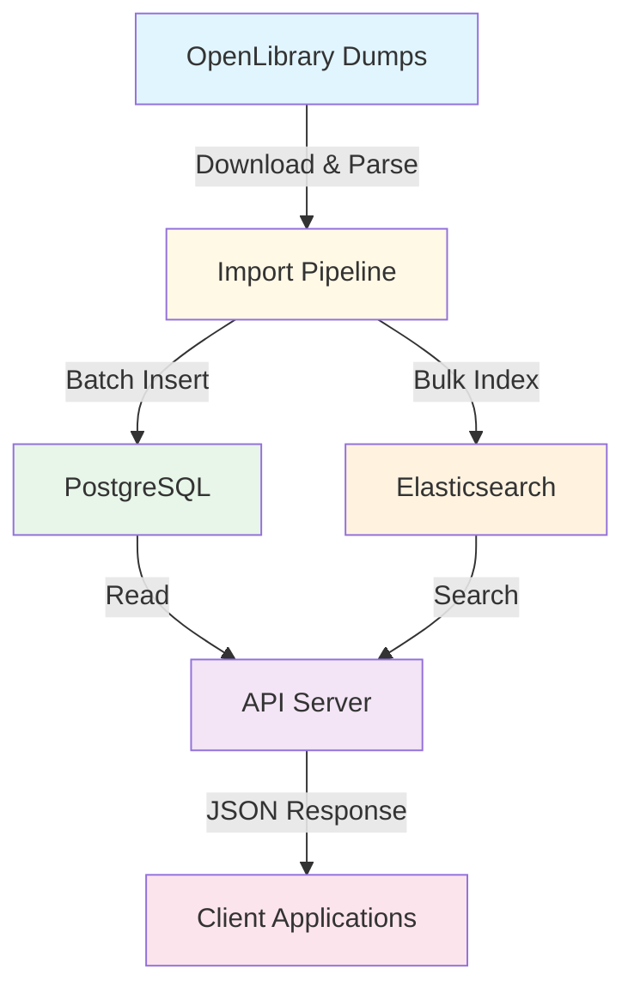

# Welcome to Echo Alexandria

Echo Alexandria is a powerful backend API service that imports and indexes book data from OpenLibrary, providing fast search and catalog browsing capabilities for book tracking applications.

## What is Echo Alexandria?

Echo Alexandria serves as a comprehensive data source for book information, offering:

- **📚 Complete Book Database**: Import and store millions of books, works, and authors from OpenLibrary
- **🔍 Fast Full-Text Search**: Elasticsearch-powered search with relevance ranking
- **📊 Catalog Browsing**: Paginated APIs for browsing authors, works, and editions
- **🔄 Automated Imports**: Monthly data refresh from OpenLibrary dumps
- **⚡ High Performance**: Built with Bun for maximum speed and efficiency

## Key Features

### OpenLibrary Integration

- Automatic import of authors, works, and editions from OpenLibrary data dumps
- Streaming parser for efficient processing of multi-gigabyte files
- Batch processing (1000 records/batch) for optimal database performance
- Progress tracking for all import operations

### Search Capabilities

- Multi-tier relevance scoring (exact, phrase, prefix, standard matching)
- Search by book title or author name
- Custom analyzers for case-insensitive, accent-insensitive search
- Pagination support for large result sets

### Catalog APIs

- Browse complete catalogs of authors, works, and editions
- Server-side pagination
- Search filtering capabilities
- Optimized database queries with GIN indexes

### Production-Ready

- Docker-based deployment
- PostgreSQL with optimized indexes
- Elasticsearch integration
- Health monitoring endpoints
- Import job tracking and status

## Architecture Overview

Echo Alexandria follows a clean, layered architecture:



## Technology Stack

- **Runtime**: [Bun](https://bun.sh) - Fast all-in-one JavaScript runtime
- **Framework**: [Hono](https://hono.dev) - Ultrafast web framework
- **Database**: [PostgreSQL](https://www.postgresql.org) 17 with GIN indexes
- **Search**: [Elasticsearch](https://www.elastic.co) 8.11
- **ORM**: [Drizzle](https://orm.drizzle.team) - TypeScript ORM
- **Language**: TypeScript

## Use Cases

Echo Alexandria is perfect for:

- **Book Tracking Apps**: Provide search and catalog functionality for personal book collections
- **Library Systems**: Browse and search large book catalogs
- **Reading Apps**: Integrate book metadata and author information
- **Data Analysis**: Access structured book data for analytics

## Quick Example

Once deployed, you can immediately start searching:

```bash
# Search for editions
curl "http://localhost:3000/api/search/editions?q=harry+potter&limit=5"

# Search for authors
curl "http://localhost:3000/api/search/authors?q=rowling"

# Check service health
curl "http://localhost:3000/health"
```

## Next Steps

Ready to get started? Follow our [Quick Start Guide](./quick-start.md) to have Echo Alexandria running in 5 minutes, or dive into the [Installation Guide](./installation.md) for detailed setup instructions.

### Documentation Sections

- **[Core Concepts](./concepts/overview.md)** - Understand the data model and architecture
- **[API Reference](./api/overview.md)** - Complete API documentation
- **[Operations](./operations/deployment.md)** - Deploy and manage in production
- **[Development](./development/local-setup.md)** - Set up your development environment

## Getting Help

- **Issues**: [GitHub Issues](https://github.com/aikenahac/echo-data-source/issues)
- **Source Code**: [GitHub Repository](https://github.com/aikenahac/echo-data-source)
- **OpenLibrary**: [OpenLibrary Documentation](https://openlibrary.org/developers)
